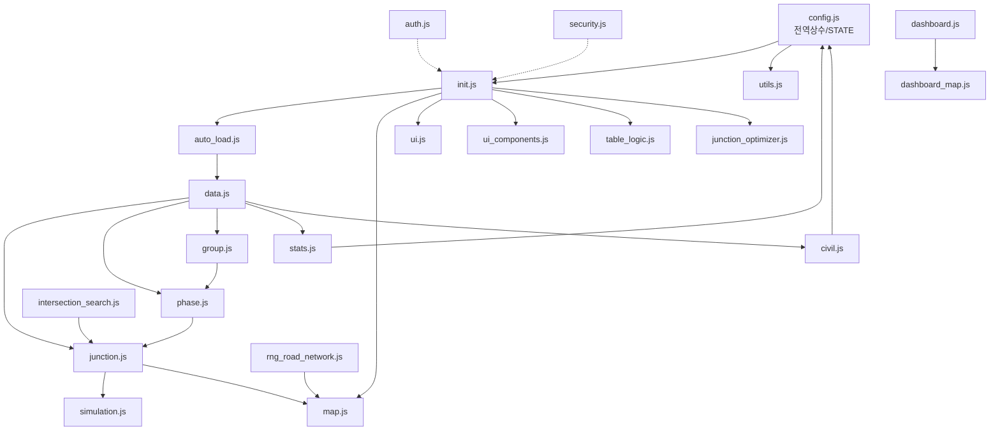
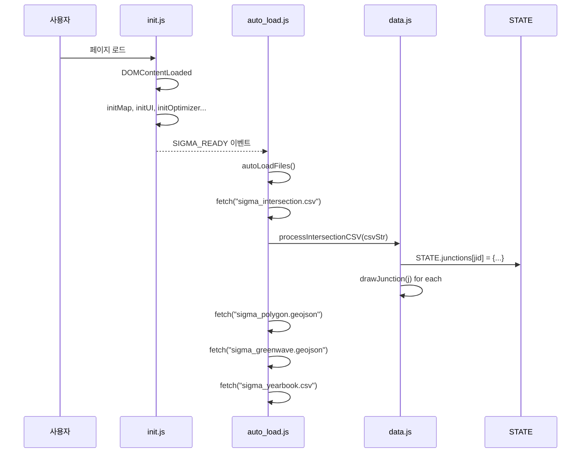
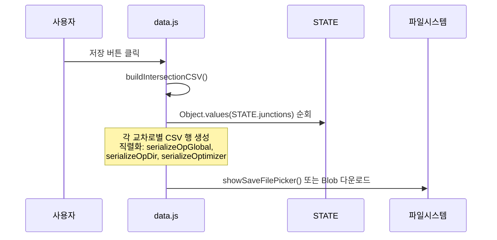

# SIGMA 신호운영관리 대시보드 - 코드 구조 매뉴얼

> **버전**: V70 (db통계분리완)  
> **최종 분석일**: 2026-03-20

---

## 1. 프로젝트 전체 구조

### 1.1 파일 구성 (22개 JS + 2개 HTML)

```
📁 프로젝트 루트
├── index.html              ← 메인 앱 (113KB)
├── dashboard.html          ← 대시보드 팝업 (34KB)
├── Sigma_Manual.html       ← 사용자 매뉴얼
├── 📁 js/
│   ├── config.js           ← 전역 상수/상태 (8KB)
│   ├── init.js             ← 앱 초기화 (2KB)
│   ├── auto_load.js        ← CSV/GeoJSON 자동 로드 (4KB)
│   ├── data.js             ← CSV 저장/로드 핵심 (34KB)
│   ├── map.js              ← Leaflet 지도 초기화 (7KB)
│   ├── junction.js         ← 교차로 마커/화살표 (38KB)
│   ├── phase.js            ← 현시/스플릿 편집 (32KB)
│   ├── simulation.js       ← 시뮬레이션 엔진 (21KB)
│   ├── group.js            ← 그룹 TOD 관리 (32KB)
│   ├── stats.js            ← 통계 렌더링/Chart.js (40KB)
│   ├── civil.js            ← 민원 데이터 관리 (52KB)
│   ├── ui.js               ← UI 상태 머신/인터랙션 (25KB)
│   ├── ui_components.js    ← SigmaUI 컴포넌트 (14KB)
│   ├── table_logic.js      ← 테이블 입력 최적화 (11KB)
│   ├── junction_optimizer.js ← 8지 교차로 최적화 SVG (47KB)
│   ├── rng_road_network.js ← 도로망(연동구간) 생성/편집 (34KB)
│   ├── intersection_search.js ← 교차로 검색 (4KB)
│   ├── dashboard.js        ← 대시보드 데이터 전송 (18KB)
│   ├── dashboard_map.js    ← 대시보드 지도 (5KB)
│   ├── utils.js            ← 유틸리티 함수 (21KB)
│   ├── auth.js             ← 로그인 인증 (1KB)
│   └── security.js         ← 코드 보호 (1KB)
├── 📁 css/                 ← 스타일시트
├── 📁 intro/               ← 인트로 영상
└── 📁 md/                  ← 문서
```

### 1.2 CSV 데이터 파일 (5종)

| 파일명 | 용도 | 크기 | 자동로드 |
|--------|------|------|----------|
| [sigma_intersection.csv](file:///c:/Users/since/OneDrive/%EB%B0%94%ED%83%95%20%ED%99%94%EB%A9%B4/260318%20%EC%8B%A0%ED%98%B8%EB%93%B1%ED%99%94%EB%8C%80%EC%8B%9C%EB%B3%B4%EB%93%9C_V70%28db%ED%86%B5%EA%B3%84%EB%B6%84%EB%A6%AC%EC%99%84%29/sigma_intersection.csv) | 교차로 신호 데이터 (메인 DB) | 15MB | ✅ |
| [sigma_group.csv](file:///c:/Users/since/OneDrive/%EB%B0%94%ED%83%95%20%ED%99%94%EB%A9%B4/260318%20%EC%8B%A0%ED%98%B8%EB%93%B1%ED%99%94%EB%8C%80%EC%8B%9C%EB%B3%B4%EB%93%9C_V70%28db%ED%86%B5%EA%B3%84%EB%B6%84%EB%A6%AC%EC%99%84%29/sigma_group.csv) | 그룹 TOD 스케줄 | 604KB | 수동 |
| [sigma_yearbook.csv](file:///c:/Users/since/OneDrive/%EB%B0%94%ED%83%95%20%ED%99%94%EB%A9%B4/260318%20%EC%8B%A0%ED%98%B8%EB%93%B1%ED%99%94%EB%8C%80%EC%8B%9C%EB%B3%B4%EB%93%9C_V70%28db%ED%86%B5%EA%B3%84%EB%B6%84%EB%A6%AC%EC%99%84%29/sigma_yearbook.csv) | 민원 연보 데이터 | 3.2MB | ✅ |
| [sigma_stats.csv](file:///c:/Users/since/OneDrive/%EB%B0%94%ED%83%95%20%ED%99%94%EB%A9%B4/260318%20%EC%8B%A0%ED%98%B8%EB%93%B1%ED%99%94%EB%8C%80%EC%8B%9C%EB%B3%B4%EB%93%9C_V70%28db%ED%86%B5%EA%B3%84%EB%B6%84%EB%A6%AC%EC%99%84%29/sigma_stats.csv) | 방향별 운영 통계 | 4KB | 수동 |
| [sigma_greenwave.geojson](file:///c:/Users/since/OneDrive/%EB%B0%94%ED%83%95%20%ED%99%94%EB%A9%B4/260318%20%EC%8B%A0%ED%98%B8%EB%93%B1%ED%99%94%EB%8C%80%EC%8B%9C%EB%B3%B4%EB%93%9C_V70%28db%ED%86%B5%EA%B3%84%EB%B6%84%EB%A6%AC%EC%99%84%29/sigma_greenwave.geojson) | 연동구간(도로망) | 1MB | ✅ |

---

## 2. JS 파일별 기능 및 의존 관계

### 2.1 의존 관계 다이어그램



---

### 2.2 각 파일 상세 설명

#### [config.js](file:///c:/Users/since/OneDrive/%EB%B0%94%ED%83%95%20%ED%99%94%EB%A9%B4/260318%20%EC%8B%A0%ED%98%B8%EB%93%B1%ED%99%94%EB%8C%80%EC%8B%9C%EB%B3%B4%EB%93%9C_V70%28db%ED%86%B5%EA%B3%84%EB%B6%84%EB%A6%AC%EC%99%84%29/js/config.js) — 전역 상수 및 상태 관리
- **역할**: 앱 전체에서 사용하는 상수, 상태 객체, 팩토리 함수 정의
- **핵심 객체**:
  - `CONFIG` — 앱 모드 상수 (`SELECT`, `MAP_EDIT`, `ADD_NODE`, `NETWORK_EDIT`)
  - `STATE` — **전체 앱 상태** (교차로, 그룹, 민원, 파일핸들 등)
  - `DAY_LABELS` — 요일 라벨 `["평일","금요일","토요일","일요일","공휴일"]`
  - `DAY_COLORS` — 요일별 차트 색상
- **팩토리 함수**:
  - [createEmptyPlan()](file:///c:/Users/since/OneDrive/%EB%B0%94%ED%83%95%20%ED%99%94%EB%A9%B4/260318%20%EC%8B%A0%ED%98%B8%EB%93%B1%ED%99%94%EB%8C%80%EC%8B%9C%EB%B3%B4%EB%93%9C_V70%28db%ED%86%B5%EA%B3%84%EB%B6%84%EB%A6%AC%EC%99%84%29/js/config.js#176-193) → 빈 현시 계획 생성
  - `createEmptySchedules()` → 빈 TOD 스케줄 생성
  - [createEmptySignalMap()](file:///c:/Users/since/OneDrive/%EB%B0%94%ED%83%95%20%ED%99%94%EB%A9%B4/260318%20%EC%8B%A0%ED%98%B8%EB%93%B1%ED%99%94%EB%8C%80%EC%8B%9C%EB%B3%B4%EB%93%9C_V70%28db%ED%86%B5%EA%B3%84%EB%B6%84%EB%A6%AC%EC%99%84%29/js/data.js#255-275) → 빈 시차맵 생성
  - [getLinkedSchedule(j, dayIdx)](file:///c:/Users/since/OneDrive/%EB%B0%94%ED%83%95%20%ED%99%94%EB%A9%B4/260318%20%EC%8B%A0%ED%98%B8%EB%93%B1%ED%99%94%EB%8C%80%EC%8B%9C%EB%B3%B4%EB%93%9C_V70%28db%ED%86%B5%EA%B3%84%EB%B6%84%EB%A6%AC%EC%99%84%29/js/utils.js#65-78) → 그룹 연동 스케줄 반환

#### [init.js](file:///c:/Users/since/OneDrive/%EB%B0%94%ED%83%95%20%ED%99%94%EB%A9%B4/260318%20%EC%8B%A0%ED%98%B8%EB%93%B1%ED%99%94%EB%8C%80%EC%8B%9C%EB%B3%B4%EB%93%9C_V70%28db%ED%86%B5%EA%B3%84%EB%B6%84%EB%A6%AC%EC%99%84%29/js/init.js) — 앱 초기화 (엔트리 포인트)
- **역할**: DOM 로드 후 모든 UI/지도/이벤트 초기화
- **실행 순서**:
  1. `DOMContentLoaded` → [initMap()](file:///c:/Users/since/OneDrive/%EB%B0%94%ED%83%95%20%ED%99%94%EB%A9%B4/260318%20%EC%8B%A0%ED%98%B8%EB%93%B1%ED%99%94%EB%8C%80%EC%8B%9C%EB%B3%B4%EB%93%9C_V70%28db%ED%86%B5%EA%B3%84%EB%B6%84%EB%A6%AC%EC%99%84%29/js/map.js#123-129), [initUI()](file:///c:/Users/since/OneDrive/%EB%B0%94%ED%83%95%20%ED%99%94%EB%A9%B4/260318%20%EC%8B%A0%ED%98%B8%EB%93%B1%ED%99%94%EB%8C%80%EC%8B%9C%EB%B3%B4%EB%93%9C_V70%28db%ED%86%B5%EA%B3%84%EB%B6%84%EB%A6%AC%EC%99%84%29/js/ui_components.js#165-170), [initUIComponents()](file:///c:/Users/since/OneDrive/%EB%B0%94%ED%83%95%20%ED%99%94%EB%A9%B4/260318%20%EC%8B%A0%ED%98%B8%EB%93%B1%ED%99%94%EB%8C%80%EC%8B%9C%EB%B3%B4%EB%93%9C_V70%28db%ED%86%B5%EA%B3%84%EB%B6%84%EB%A6%AC%EC%99%84%29/js/ui_components.js#165-170), [initTableEventHandlers()](file:///c:/Users/since/OneDrive/%EB%B0%94%ED%83%95%20%ED%99%94%EB%A9%B4/260318%20%EC%8B%A0%ED%98%B8%EB%93%B1%ED%99%94%EB%8C%80%EC%8B%9C%EB%B3%B4%EB%93%9C_V70%28db%ED%86%B5%EA%B3%84%EB%B6%84%EB%A6%AC%EC%99%84%29/js/table_logic.js#15-68), [initOptimizer()](file:///c:/Users/since/OneDrive/%EB%B0%94%ED%83%95%20%ED%99%94%EB%A9%B4/260318%20%EC%8B%A0%ED%98%B8%EB%93%B1%ED%99%94%EB%8C%80%EC%8B%9C%EB%B3%B4%EB%93%9C_V70%28db%ED%86%B5%EA%B3%84%EB%B6%84%EB%A6%AC%EC%99%84%29/js/junction_optimizer.js#126-201)
  2. `SIGMA_READY` 커스텀 이벤트 디스패치
  3. [auto_load.js](file:///c:/Users/since/OneDrive/%EB%B0%94%ED%83%95%20%ED%99%94%EB%A9%B4/260318%20%EC%8B%A0%ED%98%B8%EB%93%B1%ED%99%94%EB%8C%80%EC%8B%9C%EB%B3%B4%EB%93%9C_V70%28db%ED%86%B5%EA%B3%84%EB%B6%84%EB%A6%AC%EC%99%84%29/js/auto_load.js)의 [autoLoadFiles()](file:///c:/Users/since/OneDrive/%EB%B0%94%ED%83%95%20%ED%99%94%EB%A9%B4/260318%20%EC%8B%A0%ED%98%B8%EB%93%B1%ED%99%94%EB%8C%80%EC%8B%9C%EB%B3%B4%EB%93%9C_V70%28db%ED%86%B5%EA%B3%84%EB%B6%84%EB%A6%AC%EC%99%84%29/js/auto_load.js#7-88) 자동 트리거

#### [auto_load.js](file:///c:/Users/since/OneDrive/%EB%B0%94%ED%83%95%20%ED%99%94%EB%A9%B4/260318%20%EC%8B%A0%ED%98%B8%EB%93%B1%ED%99%94%EB%8C%80%EC%8B%9C%EB%B3%B4%EB%93%9C_V70%28db%ED%86%B5%EA%B3%84%EB%B6%84%EB%A6%AC%EC%99%84%29/js/auto_load.js) — 자동 데이터 로드
- **역할**: 앱 시작 시 필수 파일 4종 자동 로드
- **로드 대상 및 순서**:
  1. [sigma_intersection.csv](file:///c:/Users/since/OneDrive/%EB%B0%94%ED%83%95%20%ED%99%94%EB%A9%B4/260318%20%EC%8B%A0%ED%98%B8%EB%93%B1%ED%99%94%EB%8C%80%EC%8B%9C%EB%B3%B4%EB%93%9C_V70%28db%ED%86%B5%EA%B3%84%EB%B6%84%EB%A6%AC%EC%99%84%29/sigma_intersection.csv) → [processIntersectionCSV()](file:///c:/Users/since/OneDrive/%EB%B0%94%ED%83%95%20%ED%99%94%EB%A9%B4/260318%20%EC%8B%A0%ED%98%B8%EB%93%B1%ED%99%94%EB%8C%80%EC%8B%9C%EB%B3%B4%EB%93%9C_V70%28db%ED%86%B5%EA%B3%84%EB%B6%84%EB%A6%AC%EC%99%84%29/js/data.js#276-610)
  2. [sigma_polygon.geojson](file:///c:/Users/since/OneDrive/%EB%B0%94%ED%83%95%20%ED%99%94%EB%A9%B4/260318%20%EC%8B%A0%ED%98%B8%EB%93%B1%ED%99%94%EB%8C%80%EC%8B%9C%EB%B3%B4%EB%93%9C_V70%28db%ED%86%B5%EA%B3%84%EB%B6%84%EB%A6%AC%EC%99%84%29/sigma_polygon.geojson) → [processGeoJSON()](file:///c:/Users/since/OneDrive/%EB%B0%94%ED%83%95%20%ED%99%94%EB%A9%B4/260318%20%EC%8B%A0%ED%98%B8%EB%93%B1%ED%99%94%EB%8C%80%EC%8B%9C%EB%B3%B4%EB%93%9C_V70%28db%ED%86%B5%EA%B3%84%EB%B6%84%EB%A6%AC%EC%99%84%29/js/data.js#625-664)
  3. [sigma_greenwave.geojson](file:///c:/Users/since/OneDrive/%EB%B0%94%ED%83%95%20%ED%99%94%EB%A9%B4/260318%20%EC%8B%A0%ED%98%B8%EB%93%B1%ED%99%94%EB%8C%80%EC%8B%9C%EB%B3%B4%EB%93%9C_V70%28db%ED%86%B5%EA%B3%84%EB%B6%84%EB%A6%AC%EC%99%84%29/sigma_greenwave.geojson) → `RoadManager.importJSON()`
  4. [sigma_yearbook.csv](file:///c:/Users/since/OneDrive/%EB%B0%94%ED%83%95%20%ED%99%94%EB%A9%B4/260318%20%EC%8B%A0%ED%98%B8%EB%93%B1%ED%99%94%EB%8C%80%EC%8B%9C%EB%B3%B4%EB%93%9C_V70%28db%ED%86%B5%EA%B3%84%EB%B6%84%EB%A6%AC%EC%99%84%29/sigma_yearbook.csv) → [processCivilCSV()](file:///c:/Users/since/OneDrive/%EB%B0%94%ED%83%95%20%ED%99%94%EB%A9%B4/260318%20%EC%8B%A0%ED%98%B8%EB%93%B1%ED%99%94%EB%8C%80%EC%8B%9C%EB%B3%B4%EB%93%9C_V70%28db%ED%86%B5%EA%B3%84%EB%B6%84%EB%A6%AC%EC%99%84%29/js/civil.js#117-198)
- **캐싱**: `localStorage` 기반 (`MEM_CACHE` 키)
- **인코딩**: UTF-8 → EUC-KR 순차 시도

#### [data.js](file:///c:/Users/since/OneDrive/%EB%B0%94%ED%83%95%20%ED%99%94%EB%A9%B4/260318%20%EC%8B%A0%ED%98%B8%EB%93%B1%ED%99%94%EB%8C%80%EC%8B%9C%EB%B3%B4%EB%93%9C_V70%28db%ED%86%B5%EA%B3%84%EB%B6%84%EB%A6%AC%EC%99%84%29/js/data.js) — CSV 저장/로드 핵심 로직 ⭐
- **역할**: [sigma_intersection.csv](file:///c:/Users/since/OneDrive/%EB%B0%94%ED%83%95%20%ED%99%94%EB%A9%B4/260318%20%EC%8B%A0%ED%98%B8%EB%93%B1%ED%99%94%EB%8C%80%EC%8B%9C%EB%B3%B4%EB%93%9C_V70%28db%ED%86%B5%EA%B3%84%EB%B6%84%EB%A6%AC%EC%99%84%29/sigma_intersection.csv) 파읽기/쓰기, CSV↔STATE 변환
- **핵심 함수**:
  - [saveToCSV(mode)](file:///c:/Users/since/OneDrive/%EB%B0%94%ED%83%95%20%ED%99%94%EB%A9%B4/260318%20%EC%8B%A0%ED%98%B8%EB%93%B1%ED%99%94%EB%8C%80%EC%8B%9C%EB%B3%B4%EB%93%9C_V70%28db%ED%86%B5%EA%B3%84%EB%B6%84%EB%A6%AC%EC%99%84%29/js/data.js#8-73) — 전체 교차로 CSV 저장 ([save](file:///c:/Users/since/OneDrive/%EB%B0%94%ED%83%95%20%ED%99%94%EB%A9%B4/260318%20%EC%8B%A0%ED%98%B8%EB%93%B1%ED%99%94%EB%8C%80%EC%8B%9C%EB%B3%B4%EB%93%9C_V70%28db%ED%86%B5%EA%B3%84%EB%B6%84%EB%A6%AC%EC%99%84%29/js/data.js#8-73)/`saveAs`)
  - [loadFromCSV(e)](file:///c:/Users/since/OneDrive/%EB%B0%94%ED%83%95%20%ED%99%94%EB%A9%B4/260318%20%EC%8B%A0%ED%98%B8%EB%93%B1%ED%99%94%EB%8C%80%EC%8B%9C%EB%B3%B4%EB%93%9C_V70%28db%ED%86%B5%EA%B3%84%EB%B6%84%EB%A6%AC%EC%99%84%29/js/data.js#222-254) — CSV 파일 선택 및 로드
  - [buildIntersectionCSV()](file:///c:/Users/since/OneDrive/%EB%B0%94%ED%83%95%20%ED%99%94%EB%A9%B4/260318%20%EC%8B%A0%ED%98%B8%EB%93%B1%ED%99%94%EB%8C%80%EC%8B%9C%EB%B3%B4%EB%93%9C_V70%28db%ED%86%B5%EA%B3%84%EB%B6%84%EB%A6%AC%EC%99%84%29/js/data.js#74-103) — STATE → CSV 문자열 변환
  - [processIntersectionCSV(csvStr)](file:///c:/Users/since/OneDrive/%EB%B0%94%ED%83%95%20%ED%99%94%EB%A9%B4/260318%20%EC%8B%A0%ED%98%B8%EB%93%B1%ED%99%94%EB%8C%80%EC%8B%9C%EB%B3%B4%EB%93%9C_V70%28db%ED%86%B5%EA%B3%84%EB%B6%84%EB%A6%AC%EC%99%84%29/js/data.js#276-610) — CSV → STATE 파싱 **[가장 중요]**
  - [saveIndividualJunctionCSV()](file:///c:/Users/since/OneDrive/%EB%B0%94%ED%83%95%20%ED%99%94%EB%A9%B4/260318%20%EC%8B%A0%ED%98%B8%EB%93%B1%ED%99%94%EB%8C%80%EC%8B%9C%EB%B3%B4%EB%93%9C_V70%28db%ED%86%B5%EA%B3%84%EB%B6%84%EB%A6%AC%EC%99%84%29/js/data.js#121-155) — 단일 교차로 CSV 내보내기
- **File System Access API**: `showSaveFilePicker` / `showOpenFilePicker` 사용

#### [map.js](file:///c:/Users/since/OneDrive/%EB%B0%94%ED%83%95%20%ED%99%94%EB%A9%B4/260318%20%EC%8B%A0%ED%98%B8%EB%93%B1%ED%99%94%EB%8C%80%EC%8B%9C%EB%B3%B4%EB%93%9C_V70%28db%ED%86%B5%EA%B3%84%EB%B6%84%EB%A6%AC%EC%99%84%29/js/map.js) — Leaflet 지도 관리
- **역할**: 지도 초기화, 타일 레이어, 테마 전환, GeoJSON 배경
- **핵심 함수**:
  - [initMap()](file:///c:/Users/since/OneDrive/%EB%B0%94%ED%83%95%20%ED%99%94%EB%A9%B4/260318%20%EC%8B%A0%ED%98%B8%EB%93%B1%ED%99%94%EB%8C%80%EC%8B%9C%EB%B3%B4%EB%93%9C_V70%28db%ED%86%B5%EA%B3%84%EB%B6%84%EB%A6%AC%EC%99%84%29/js/map.js#123-129) — Leaflet 맵 생성 (중심: 서울, 줌 13)
  - [toggleMapTheme()](file:///c:/Users/since/OneDrive/%EB%B0%94%ED%83%95%20%ED%99%94%EB%A9%B4/260318%20%EC%8B%A0%ED%98%B8%EB%93%B1%ED%99%94%EB%8C%80%EC%8B%9C%EB%B3%B4%EB%93%9C_V70%28db%ED%86%B5%EA%B3%84%EB%B6%84%EB%A6%AC%EC%99%84%29/js/map.js#26-51) — 다크/OSM/라이트 테마 순환
  - [updateGeoJsonStyle()](file:///c:/Users/since/OneDrive/%EB%B0%94%ED%83%95%20%ED%99%94%EB%A9%B4/260318%20%EC%8B%A0%ED%98%B8%EB%93%B1%ED%99%94%EB%8C%80%EC%8B%9C%EB%B3%B4%EB%93%9C_V70%28db%ED%86%B5%EA%B3%84%EB%B6%84%EB%A6%AC%EC%99%84%29/js/map.js#52-66) — GeoJSON 레이어 스타일 갱신
- **타일 레이어**: CartoDB Dark, OSM, CartoDB Light

#### [junction.js](file:///c:/Users/since/OneDrive/%EB%B0%94%ED%83%95%20%ED%99%94%EB%A9%B4/260318%20%EC%8B%A0%ED%98%B8%EB%93%B1%ED%99%94%EB%8C%80%EC%8B%9C%EB%B3%B4%EB%93%9C_V70%28db%ED%86%B5%EA%B3%84%EB%B6%84%EB%A6%AC%EC%99%84%29/js/junction.js) — 교차로 마커 및 화살표 ⭐
- **역할**: 지도 위 교차로 마커 그리기, 신호 화살표 생성/관리
- **핵심 함수**:
  - [drawJunction(j)](file:///c:/Users/since/OneDrive/%EB%B0%94%ED%83%95%20%ED%99%94%EB%A9%B4/260318%20%EC%8B%A0%ED%98%B8%EB%93%B1%ED%99%94%EB%8C%80%EC%8B%9C%EB%B3%B4%EB%93%9C_V70%28db%ED%86%B5%EA%B3%84%EB%B6%84%EB%A6%AC%EC%99%84%29/js/junction.js#8-92) — 마커 생성 및 지도 배치
  - [selectJunction(jid)](file:///c:/Users/since/OneDrive/%EB%B0%94%ED%83%95%20%ED%99%94%EB%A9%B4/260318%20%EC%8B%A0%ED%98%B8%EB%93%B1%ED%99%94%EB%8C%80%EC%8B%9C%EB%B3%B4%EB%93%9C_V70%28db%ED%86%B5%EA%B3%84%EB%B6%84%EB%A6%AC%EC%99%84%29/js/junction.js#458-614) — 교차로 선택 → 우측 사이드바 정보 표시
  - [deselectJunction()](file:///c:/Users/since/OneDrive/%EB%B0%94%ED%83%95%20%ED%99%94%EB%A9%B4/260318%20%EC%8B%A0%ED%98%B8%EB%93%B1%ED%99%94%EB%8C%80%EC%8B%9C%EB%B3%B4%EB%93%9C_V70%28db%ED%86%B5%EA%B3%84%EB%B6%84%EB%A6%AC%EC%99%84%29/js/junction.js#615-650) — 선택 해제
  - [createArrows(j)](file:///c:/Users/since/OneDrive/%EB%B0%94%ED%83%95%20%ED%99%94%EB%A9%B4/260318%20%EC%8B%A0%ED%98%B8%EB%93%B1%ED%99%94%EB%8C%80%EC%8B%9C%EB%B3%B4%EB%93%9C_V70%28db%ED%86%B5%EA%B3%84%EB%B6%84%EB%A6%AC%EC%99%84%29/js/junction.js#93-346) — 이동류별 신호 화살표 생성
  - [removeArrows()](file:///c:/Users/since/OneDrive/%EB%B0%94%ED%83%95%20%ED%99%94%EB%A9%B4/260318%20%EC%8B%A0%ED%98%B8%EB%93%B1%ED%99%94%EB%8C%80%EC%8B%9C%EB%B3%B4%EB%93%9C_V70%28db%ED%86%B5%EA%B3%84%EB%B6%84%EB%A6%AC%EC%99%84%29/js/junction.js#385-395) — 화살표 제거
  - [duplicateArrow(m)](file:///c:/Users/since/OneDrive/%EB%B0%94%ED%83%95%20%ED%99%94%EB%A9%B4/260318%20%EC%8B%A0%ED%98%B8%EB%93%B1%ED%99%94%EB%8C%80%EC%8B%9C%EB%B3%B4%EB%93%9C_V70%28db%ED%86%B5%EA%B3%84%EB%B6%84%EB%A6%AC%EC%99%84%29/js/junction.js#347-369) / [deleteArrow(m, idx)](file:///c:/Users/since/OneDrive/%EB%B0%94%ED%83%95%20%ED%99%94%EB%A9%B4/260318%20%EC%8B%A0%ED%98%B8%EB%93%B1%ED%99%94%EB%8C%80%EC%8B%9C%EB%B3%B4%EB%93%9C_V70%28db%ED%86%B5%EA%B3%84%EB%B6%84%EB%A6%AC%EC%99%84%29/js/junction.js#370-384) — 화살표 복제/삭제
  - [refreshVisibleArrows()](file:///c:/Users/since/OneDrive/%EB%B0%94%ED%83%95%20%ED%99%94%EB%A9%B4/260318%20%EC%8B%A0%ED%98%B8%EB%93%B1%ED%99%94%EB%8C%80%EC%8B%9C%EB%B3%B4%EB%93%9C_V70%28db%ED%86%B5%EA%B3%84%EB%B6%84%EB%A6%AC%EC%99%84%29/js/junction.js#396-412) — 화면 내 화살표 새로고침
  - [syncActiveJunctionData()](file:///c:/Users/since/OneDrive/%EB%B0%94%ED%83%95%20%ED%99%94%EB%A9%B4/260318%20%EC%8B%A0%ED%98%B8%EB%93%B1%ED%99%94%EB%8C%80%EC%8B%9C%EB%B3%B4%EB%93%9C_V70%28db%ED%86%B5%EA%B3%84%EB%B6%84%EB%A6%AC%EC%99%84%29/js/junction.js#680-784) — UI 입력 → STATE 동기화

#### [phase.js](file:///c:/Users/since/OneDrive/%EB%B0%94%ED%83%95%20%ED%99%94%EB%A9%B4/260318%20%EC%8B%A0%ED%98%B8%EB%93%B1%ED%99%94%EB%8C%80%EC%8B%9C%EB%B3%B4%EB%93%9C_V70%28db%ED%86%B5%EA%B3%84%EB%B6%84%EB%A6%AC%EC%99%84%29/js/phase.js) — 현시/스플릿 편집 ⭐
- **역할**: Phase/Split 테이블 렌더링, TOD 요약, 설정 저장
- **핵심 함수**:
  - [renderRingTables()](file:///c:/Users/since/OneDrive/%EB%B0%94%ED%83%95%20%ED%99%94%EB%A9%B4/260318%20%EC%8B%A0%ED%98%B8%EB%93%B1%ED%99%94%EB%8C%80%EC%8B%9C%EB%B3%B4%EB%93%9C_V70%28db%ED%86%B5%EA%B3%84%EB%B6%84%EB%A6%AC%EC%99%84%29/js/phase.js#9-186) — 이중링(A/B) 현시 테이블 렌더링
  - [renderSummaryTable()](file:///c:/Users/since/OneDrive/%EB%B0%94%ED%83%95%20%ED%99%94%EB%A9%B4/260318%20%EC%8B%A0%ED%98%B8%EB%93%B1%ED%99%94%EB%8C%80%EC%8B%9C%EB%B3%B4%EB%93%9C_V70%28db%ED%86%B5%EA%B3%84%EB%B6%84%EB%A6%AC%EC%99%84%29/js/phase.js#370-441) — TOD 스케줄 요약 테이블
  - [applyPhaseTemplate(code)](file:///c:/Users/since/OneDrive/%EB%B0%94%ED%83%95%20%ED%99%94%EB%A9%B4/260318%20%EC%8B%A0%ED%98%B8%EB%93%B1%ED%99%94%EB%8C%80%EC%8B%9C%EB%B3%B4%EB%93%9C_V70%28db%ED%86%B5%EA%B3%84%EB%B6%84%EB%A6%AC%EC%99%84%29/js/phase.js#590-682) — 현시 템플릿 적용
  - [saveSettingsAndApply()](file:///c:/Users/since/OneDrive/%EB%B0%94%ED%83%95%20%ED%99%94%EB%A9%B4/260318%20%EC%8B%A0%ED%98%B8%EB%93%B1%ED%99%94%EB%8C%80%EC%8B%9C%EB%B3%B4%EB%93%9C_V70%28db%ED%86%B5%EA%B3%84%EB%B6%84%EB%A6%AC%EC%99%84%29/js/phase.js#284-358) — Phase/Split 설정 저장 및 화살표 재생성
- **데이터 구조**: `dayPlans[5][n]` (요일별 플랜) → `{splitA, splitB, allredA, allredB, yellowA, yellowB, pedDelayA, pedDelayB, offset}`

#### [simulation.js](file:///c:/Users/since/OneDrive/%EB%B0%94%ED%83%95%20%ED%99%94%EB%A9%B4/260318%20%EC%8B%A0%ED%98%B8%EB%93%B1%ED%99%94%EB%8C%80%EC%8B%9C%EB%B3%B4%EB%93%9C_V70%28db%ED%86%B5%EA%B3%84%EB%B6%84%EB%A6%AC%EC%99%84%29/js/simulation.js) — 시뮬레이션 엔진
- **역할**: 시간 기반 신호 시뮬레이션, 화살표 색상 제어
- **핵심 함수**:
  - [toggleSim()](file:///c:/Users/since/OneDrive/%EB%B0%94%ED%83%95%20%ED%99%94%EB%A9%B4/260318%20%EC%8B%A0%ED%98%B8%EB%93%B1%ED%99%94%EB%8C%80%EC%8B%9C%EB%B3%B4%EB%93%9C_V70%28db%ED%86%B5%EA%B3%84%EB%B6%84%EB%A6%AC%EC%99%84%29/js/simulation.js#8-15) / [startSim()](file:///c:/Users/since/OneDrive/%EB%B0%94%ED%83%95%20%ED%99%94%EB%A9%B4/260318%20%EC%8B%A0%ED%98%B8%EB%93%B1%ED%99%94%EB%8C%80%EC%8B%9C%EB%B3%B4%EB%93%9C_V70%28db%ED%86%B5%EA%B3%84%EB%B6%84%EB%A6%AC%EC%99%84%29/js/simulation.js#16-34) / [pauseSim()](file:///c:/Users/since/OneDrive/%EB%B0%94%ED%83%95%20%ED%99%94%EB%A9%B4/260318%20%EC%8B%A0%ED%98%B8%EB%93%B1%ED%99%94%EB%8C%80%EC%8B%9C%EB%B3%B4%EB%93%9C_V70%28db%ED%86%B5%EA%B3%84%EB%B6%84%EB%A6%AC%EC%99%84%29/js/simulation.js#35-48) — 재생 제어
  - [setSpeed(s)](file:///c:/Users/since/OneDrive/%EB%B0%94%ED%83%95%20%ED%99%94%EB%A9%B4/260318%20%EC%8B%A0%ED%98%B8%EB%93%B1%ED%99%94%EB%8C%80%EC%8B%9C%EB%B3%B4%EB%93%9C_V70%28db%ED%86%B5%EA%B3%84%EB%B6%84%EB%A6%AC%EC%99%84%29/js/simulation.js#49-61) — 시뮬레이션 속도 설정 (1x~64x)
  - [updateSim()](file:///c:/Users/since/OneDrive/%EB%B0%94%ED%83%95%20%ED%99%94%EB%A9%B4/260318%20%EC%8B%A0%ED%98%B8%EB%93%B1%ED%99%94%EB%8C%80%EC%8B%9C%EB%B3%B4%EB%93%9C_V70%28db%ED%86%B5%EA%B3%84%EB%B6%84%EB%A6%AC%EC%99%84%29/js/simulation.js#62-384) — **메인 루프**: 시간 진행 → 화살표 상태 업데이트
- **시뮬레이션 로직**: 주기 내 경과 시간 → splitA/B 누적 비교 → 녹색/적색 판정

#### [group.js](file:///c:/Users/since/OneDrive/%EB%B0%94%ED%83%95%20%ED%99%94%EB%A9%B4/260318%20%EC%8B%A0%ED%98%B8%EB%93%B1%ED%99%94%EB%8C%80%EC%8B%9C%EB%B3%B4%EB%93%9C_V70%28db%ED%86%B5%EA%B3%84%EB%B6%84%EB%A6%AC%EC%99%84%29/js/group.js) — 그룹 TOD 관리 ⭐
- **역할**: 교차로 그룹 편집, 그룹 TOD 스케줄, 주기 차트
- **핵심 함수**:
  - [loadGroupInfo(groupId)](file:///c:/Users/since/OneDrive/%EB%B0%94%ED%83%95%20%ED%99%94%EB%A9%B4/260318%20%EC%8B%A0%ED%98%B8%EB%93%B1%ED%99%94%EB%8C%80%EC%8B%9C%EB%B3%B4%EB%93%9C_V70%28db%ED%86%B5%EA%B3%84%EB%B6%84%EB%A6%AC%EC%99%84%29/js/group.js#107-191) — 그룹 정보 로드 및 멤버 강조
  - [renderGroupTODTable()](file:///c:/Users/since/OneDrive/%EB%B0%94%ED%83%95%20%ED%99%94%EB%A9%B4/260318%20%EC%8B%A0%ED%98%B8%EB%93%B1%ED%99%94%EB%8C%80%EC%8B%9C%EB%B3%B4%EB%93%9C_V70%28db%ED%86%B5%EA%B3%84%EB%B6%84%EB%A6%AC%EC%99%84%29/js/group.js#304-350) — 그룹 TOD 테이블 렌더링
  - [renderGroupCycleChart()](file:///c:/Users/since/OneDrive/%EB%B0%94%ED%83%95%20%ED%99%94%EB%A9%B4/260318%20%EC%8B%A0%ED%98%B8%EB%93%B1%ED%99%94%EB%8C%80%EC%8B%9C%EB%B3%B4%EB%93%9C_V70%28db%ED%86%B5%EA%B3%84%EB%B6%84%EB%A6%AC%EC%99%84%29/js/group.js#351-420) — 주기 비교 차트 (Chart.js)
  - [saveGroupCSV()](file:///c:/Users/since/OneDrive/%EB%B0%94%ED%83%95%20%ED%99%94%EB%A9%B4/260318%20%EC%8B%A0%ED%98%B8%EB%93%B1%ED%99%94%EB%8C%80%EC%8B%9C%EB%B3%B4%EB%93%9C_V70%28db%ED%86%B5%EA%B3%84%EB%B6%84%EB%A6%AC%EC%99%84%29/js/group.js#514-571) / [loadGroupCSV()](file:///c:/Users/since/OneDrive/%EB%B0%94%ED%83%95%20%ED%99%94%EB%A9%B4/260318%20%EC%8B%A0%ED%98%B8%EB%93%B1%ED%99%94%EB%8C%80%EC%8B%9C%EB%B3%B4%EB%93%9C_V70%28db%ED%86%B5%EA%B3%84%EB%B6%84%EB%A6%AC%EC%99%84%29/js/group.js#572-596) — 그룹 CSV 저장/로드
  - [highlightGroupMembers(groupId)](file:///c:/Users/since/OneDrive/%EB%B0%94%ED%83%95%20%ED%99%94%EB%A9%B4/260318%20%EC%8B%A0%ED%98%B8%EB%93%B1%ED%99%94%EB%8C%80%EC%8B%9C%EB%B3%B4%EB%93%9C_V70%28db%ED%86%B5%EA%B3%84%EB%B6%84%EB%A6%AC%EC%99%84%29/js/group.js#59-101) — 지도 위 그룹 멤버 강조

#### [stats.js](file:///c:/Users/since/OneDrive/%EB%B0%94%ED%83%95%20%ED%99%94%EB%A9%B4/260318%20%EC%8B%A0%ED%98%B8%EB%93%B1%ED%99%94%EB%8C%80%EC%8B%9C%EB%B3%B4%EB%93%9C_V70%28db%ED%86%B5%EA%B3%84%EB%B6%84%EB%A6%AC%EC%99%84%29/js/stats.js) — 통계 렌더링 및 CSV ⭐
- **역할**: 운영통계 테이블, 교차로 통계, 전체 통계 차트, [sigma_stats.csv](file:///c:/Users/since/OneDrive/%EB%B0%94%ED%83%95%20%ED%99%94%EB%A9%B4/260318%20%EC%8B%A0%ED%98%B8%EB%93%B1%ED%99%94%EB%8C%80%EC%8B%9C%EB%B3%B4%EB%93%9C_V70%28db%ED%86%B5%EA%B3%84%EB%B6%84%EB%A6%AC%EC%99%84%29/sigma_stats.csv) 입출력
- **핵심 함수**:
  - [renderOpStatsTable()](file:///c:/Users/since/OneDrive/%EB%B0%94%ED%83%95%20%ED%99%94%EB%A9%B4/260318%20%EC%8B%A0%ED%98%B8%EB%93%B1%ED%99%94%EB%8C%80%EC%8B%9C%EB%B3%B4%EB%93%9C_V70%28db%ED%86%B5%EA%B3%84%EB%B6%84%EB%A6%AC%EC%99%84%29/js/stats.js#21-191) — 방향별 운영통계 테이블 (차로, 횡단보도, 신호운영, 감응)
  - [renderJunctionStatsTable()](file:///c:/Users/since/OneDrive/%EB%B0%94%ED%83%95%20%ED%99%94%EB%A9%B4/260318%20%EC%8B%A0%ED%98%B8%EB%93%B1%ED%99%94%EB%8C%80%EC%8B%9C%EB%B3%B4%EB%93%9C_V70%28db%ED%86%B5%EA%B3%84%EB%B6%84%EB%A6%AC%EC%99%84%29/js/stats.js#192-246) — 교차로 전역 통계 (접근로, 보호구역, 제어기 등)
  - [renderStats()](file:///c:/Users/since/OneDrive/%EB%B0%94%ED%83%95%20%ED%99%94%EB%A9%B4/260318%20%EC%8B%A0%ED%98%B8%EB%93%B1%ED%99%94%EB%8C%80%EC%8B%9C%EB%B3%B4%EB%93%9C_V70%28db%ED%86%B5%EA%B3%84%EB%B6%84%EB%A6%AC%EC%99%84%29/js/stats.js#247-485) — 전체 통계 (주기분포, 시간대별 평균, 운영요약)
  - [saveStatsCSV()](file:///c:/Users/since/OneDrive/%EB%B0%94%ED%83%95%20%ED%99%94%EB%A9%B4/260318%20%EC%8B%A0%ED%98%B8%EB%93%B1%ED%99%94%EB%8C%80%EC%8B%9C%EB%B3%B4%EB%93%9C_V70%28db%ED%86%B5%EA%B3%84%EB%B6%84%EB%A6%AC%EC%99%84%29/js/stats.js#669-683) / [handleStatsFileSelect()](file:///c:/Users/since/OneDrive/%EB%B0%94%ED%83%95%20%ED%99%94%EB%A9%B4/260318%20%EC%8B%A0%ED%98%B8%EB%93%B1%ED%99%94%EB%8C%80%EC%8B%9C%EB%B3%B4%EB%93%9C_V70%28db%ED%86%B5%EA%B3%84%EB%B6%84%EB%A6%AC%EC%99%84%29/js/stats.js#684-701) — [sigma_stats.csv](file:///c:/Users/since/OneDrive/%EB%B0%94%ED%83%95%20%ED%99%94%EB%A9%B4/260318%20%EC%8B%A0%ED%98%B8%EB%93%B1%ED%99%94%EB%8C%80%EC%8B%9C%EB%B3%B4%EB%93%9C_V70%28db%ED%86%B5%EA%B3%84%EB%B6%84%EB%A6%AC%EC%99%84%29/sigma_stats.csv) 저장/로드
- **Stats CSV 구조**: `STATS_GLOBAL_MAP` (전역 Boolean), `STATS_BOOL_MAP` (방향별 Boolean), 방향별 차로 직렬화

#### [civil.js](file:///c:/Users/since/OneDrive/%EB%B0%94%ED%83%95%20%ED%99%94%EB%A9%B4/260318%20%EC%8B%A0%ED%98%B8%EB%93%B1%ED%99%94%EB%8C%80%EC%8B%9C%EB%B3%B4%EB%93%9C_V70%28db%ED%86%B5%EA%B3%84%EB%B6%84%EB%A6%AC%EC%99%84%29/js/civil.js) — 민원 데이터 관리
- **역할**: 민원 CSV 파싱, 민원 요약, 교차로별 민원 내역, 전체 테이블 팝업
- **핵심 함수**:
  - [loadCivilCSV(e)](file:///c:/Users/since/OneDrive/%EB%B0%94%ED%83%95%20%ED%99%94%EB%A9%B4/260318%20%EC%8B%A0%ED%98%B8%EB%93%B1%ED%99%94%EB%8C%80%EC%8B%9C%EB%B3%B4%EB%93%9C_V70%28db%ED%86%B5%EA%B3%84%EB%B6%84%EB%A6%AC%EC%99%84%29/js/civil.js#86-116) — 민원 CSV 파일 로드
  - [processCivilCSV(csvStr)](file:///c:/Users/since/OneDrive/%EB%B0%94%ED%83%95%20%ED%99%94%EB%A9%B4/260318%20%EC%8B%A0%ED%98%B8%EB%93%B1%ED%99%94%EB%8C%80%EC%8B%9C%EB%B3%B4%EB%93%9C_V70%28db%ED%86%B5%EA%B3%84%EB%B6%84%EB%A6%AC%EC%99%84%29/js/civil.js#117-198) — CSV 파싱 → `STATE.civilData`, `STATE.civilDataByJid`
  - [renderCivilSummary()](file:///c:/Users/since/OneDrive/%EB%B0%94%ED%83%95%20%ED%99%94%EB%A9%B4/260318%20%EC%8B%A0%ED%98%B8%EB%93%B1%ED%99%94%EB%8C%80%EC%8B%9C%EB%B3%B4%EB%93%9C_V70%28db%ED%86%B5%EA%B3%84%EB%B6%84%EB%A6%AC%EC%99%84%29/js/civil.js#299-456) — 연도/월 필터 + 유형별 통계
  - [renderCivilStats(jid)](file:///c:/Users/since/OneDrive/%EB%B0%94%ED%83%95%20%ED%99%94%EB%A9%B4/260318%20%EC%8B%A0%ED%98%B8%EB%93%B1%ED%99%94%EB%8C%80%EC%8B%9C%EB%B3%B4%EB%93%9C_V70%28db%ED%86%B5%EA%B3%84%EB%B6%84%EB%A6%AC%EC%99%84%29/js/civil.js#457-569) — 교차로별 민원 내역 카드
  - [saveCivilCSV(mode)](file:///c:/Users/since/OneDrive/%EB%B0%94%ED%83%95%20%ED%99%94%EB%A9%B4/260318%20%EC%8B%A0%ED%98%B8%EB%93%B1%ED%99%94%EB%8C%80%EC%8B%9C%EB%B3%B4%EB%93%9C_V70%28db%ED%86%B5%EA%B3%84%EB%B6%84%EB%A6%AC%EC%99%84%29/js/civil.js#199-243) — 민원 CSV 저장
  - [showCivilFullTable()](file:///c:/Users/since/OneDrive/%EB%B0%94%ED%83%95%20%ED%99%94%EB%A9%B4/260318%20%EC%8B%A0%ED%98%B8%EB%93%B1%ED%99%94%EB%8C%80%EC%8B%9C%EB%B3%B4%EB%93%9C_V70%28db%ED%86%B5%EA%B3%84%EB%B6%84%EB%A6%AC%EC%99%84%29/js/civil.js#713-958) — 전체 데이터 편집 팝업 (가상화 테이블)
- **매칭 로직**: `교차로번호 × 10` → `STATE.junctions[jid].seq`로 매칭

#### [ui.js](file:///c:/Users/since/OneDrive/%EB%B0%94%ED%83%95%20%ED%99%94%EB%A9%B4/260318%20%EC%8B%A0%ED%98%B8%EB%93%B1%ED%99%94%EB%8C%80%EC%8B%9C%EB%B3%B4%EB%93%9C_V70%28db%ED%86%B5%EA%B3%84%EB%B6%84%EB%A6%AC%EC%99%84%29/js/ui.js) — UI 상태 머신
- **역할**: 앱 모드 관리, 탭 전환, 사이드바, 비주얼 설정
- **핵심 객체**:
  - `AppStateMachine` — 앱 모드 전환 (`SELECT`, `MAP_EDIT`, `ADD_NODE`, `NETWORK_EDIT`)
  - [UI](file:///c:/Users/since/OneDrive/%EB%B0%94%ED%83%95%20%ED%99%94%EB%A9%B4/260318%20%EC%8B%A0%ED%98%B8%EB%93%B1%ED%99%94%EB%8C%80%EC%8B%9C%EB%B3%B4%EB%93%9C_V70%28db%ED%86%B5%EA%B3%84%EB%B6%84%EB%A6%AC%EC%99%84%29/js/junction_optimizer.js#365-383) — DOM 요소 참조 캐시
- **핵심 함수**:
  - [initUI()](file:///c:/Users/since/OneDrive/%EB%B0%94%ED%83%95%20%ED%99%94%EB%A9%B4/260318%20%EC%8B%A0%ED%98%B8%EB%93%B1%ED%99%94%EB%8C%80%EC%8B%9C%EB%B3%B4%EB%93%9C_V70%28db%ED%86%B5%EA%B3%84%EB%B6%84%EB%A6%AC%EC%99%84%29/js/ui_components.js#165-170) — 모든 UI 이벤트 바인딩
  - [toggleSignalMode()](file:///c:/Users/since/OneDrive/%EB%B0%94%ED%83%95%20%ED%99%94%EB%A9%B4/260318%20%EC%8B%A0%ED%98%B8%EB%93%B1%ED%99%94%EB%8C%80%EC%8B%9C%EB%B3%B4%EB%93%9C_V70%28db%ED%86%B5%EA%B3%84%EB%B6%84%EB%A6%AC%EC%99%84%29/js/ui.js#475-502) — 신호등화/주기/연동/민원 비주얼 모드 전환
  - [updateScales()](file:///c:/Users/since/OneDrive/%EB%B0%94%ED%83%95%20%ED%99%94%EB%A9%B4/260318%20%EC%8B%A0%ED%98%B8%EB%93%B1%ED%99%94%EB%8C%80%EC%8B%9C%EB%B3%B4%EB%93%9C_V70%28db%ED%86%B5%EA%B3%84%EB%B6%84%EB%A6%AC%EC%99%84%29/js/ui.js#311-336) — 노드/화살표/도로 크기/텍스트 슬라이더

#### [ui_components.js](file:///c:/Users/since/OneDrive/%EB%B0%94%ED%83%95%20%ED%99%94%EB%A9%B4/260318%20%EC%8B%A0%ED%98%B8%EB%93%B1%ED%99%94%EB%8C%80%EC%8B%9C%EB%B3%B4%EB%93%9C_V70%28db%ED%86%B5%EA%B3%84%EB%B6%84%EB%A6%AC%EC%99%84%29/js/ui_components.js) — 재사용 UI 컴포넌트
- **역할**: 동적 UI 렌더링 모듈
- **핵심 객체**:
  - `SigmaUI.renderTable()` — JSON 기반 테이블 렌더링
  - `SigmaUI.renderGrid()` — 입력 폼 그리드 렌더링
  - `SigmaUI.renderFlashGrid()` — 점멸 신호 그리드
  - `SigmaUI.renderArrowCountGrid()` — 화살표 수량 설정
  - `SigmaUI.renderOpInterventionGrid()` — 운영자 개입 그리드
- **데이터**: `INFO_FIELDS` (교차로 정보 필드 9개), `ACTUATION_GROUPS` (감응 3그룹)

#### [table_logic.js](file:///c:/Users/since/OneDrive/%EB%B0%94%ED%83%95%20%ED%99%94%EB%A9%B4/260318%20%EC%8B%A0%ED%98%B8%EB%93%B1%ED%99%94%EB%8C%80%EC%8B%9C%EB%B3%B4%EB%93%9C_V70%28db%ED%86%B5%EA%B3%84%EB%B6%84%EB%A6%AC%EC%99%84%29/js/table_logic.js) — 테이블 입력 최적화
- **역할**: Phase/Split, Mov, Schedule, GroupTOD 테이블의 입력 핸들링 및 디바운싱
- **핵심 함수**:
  - [handleTableInput(el)](file:///c:/Users/since/OneDrive/%EB%B0%94%ED%83%95%20%ED%99%94%EB%A9%B4/260318%20%EC%8B%A0%ED%98%B8%EB%93%B1%ED%99%94%EB%8C%80%EC%8B%9C%EB%B3%B4%EB%93%9C_V70%28db%ED%86%B5%EA%B3%84%EB%B6%84%EB%A6%AC%EC%99%84%29/js/table_logic.js#69-110) — Split/AllRed/Yellow 입력 처리 (Dual Ring 동기화)
  - [handleMovInput(el)](file:///c:/Users/since/OneDrive/%EB%B0%94%ED%83%95%20%ED%99%94%EB%A9%B4/260318%20%EC%8B%A0%ED%98%B8%EB%93%B1%ED%99%94%EB%8C%80%EC%8B%9C%EB%B3%B4%EB%93%9C_V70%28db%ED%86%B5%EA%B3%84%EB%B6%84%EB%A6%AC%EC%99%84%29/js/table_logic.js#111-139) — 이동류 설정 입력 처리
  - [handleSchedInput(el)](file:///c:/Users/since/OneDrive/%EB%B0%94%ED%83%95%20%ED%99%94%EB%A9%B4/260318%20%EC%8B%A0%ED%98%B8%EB%93%B1%ED%99%94%EB%8C%80%EC%8B%9C%EB%B3%B4%EB%93%9C_V70%28db%ED%86%B5%EA%B3%84%EB%B6%84%EB%A6%AC%EC%99%84%29/js/table_logic.js#141-165) — TOD 스케줄 (시:분, 주기) 입력
  - [handleTableKeyNavigation(e)](file:///c:/Users/since/OneDrive/%EB%B0%94%ED%83%95%20%ED%99%94%EB%A9%B4/260318%20%EC%8B%A0%ED%98%B8%EB%93%B1%ED%99%94%EB%8C%80%EC%8B%9C%EB%B3%B4%EB%93%9C_V70%28db%ED%86%B5%EA%B3%84%EB%B6%84%EB%A6%AC%EC%99%84%29/js/table_logic.js#265-316) — 방향키 셀 이동
  - [debounceUpdateHeavyUI()](file:///c:/Users/since/OneDrive/%EB%B0%94%ED%83%95%20%ED%99%94%EB%A9%B4/260318%20%EC%8B%A0%ED%98%B8%EB%93%B1%ED%99%94%EB%8C%80%EC%8B%9C%EB%B3%B4%EB%93%9C_V70%28db%ED%86%B5%EA%B3%84%EB%B6%84%EB%A6%AC%EC%99%84%29/js/table_logic.js#246-255) — 800ms 디바운스 갱신

#### [junction_optimizer.js](file:///c:/Users/since/OneDrive/%EB%B0%94%ED%83%95%20%ED%99%94%EB%A9%B4/260318%20%EC%8B%A0%ED%98%B8%EB%93%B1%ED%99%94%EB%8C%80%EC%8B%9C%EB%B3%B4%EB%93%9C_V70%28db%ED%86%B5%EA%B3%84%EB%B6%84%EB%A6%AC%EC%99%84%29/js/junction_optimizer.js) — 8지 교차로 최적화
- **역할**: SVG 기반 교차로 형상 시각화, 방향별 차로/운영 상세 설정
- **데이터**:
  - `OPT_DIRS` — 8방향 정의 (N, E, S, W, NE, SE, SW, NW)
  - `OPT_TYPES` — 차로 유형 12종 (C, U, LU, L, LT, T, TR, R, R_D, CW, CW_D, SPD)
  - `opt_state` — 8방향별 차로 수, 시설, 운영 상태
  - `opt_junctionState` — 교차로 전역 상태 (제어기, 점멸, 긴급)
- **핵심 함수**:
  - [initOptimizer()](file:///c:/Users/since/OneDrive/%EB%B0%94%ED%83%95%20%ED%99%94%EB%A9%B4/260318%20%EC%8B%A0%ED%98%B8%EB%93%B1%ED%99%94%EB%8C%80%EC%8B%9C%EB%B3%B4%EB%93%9C_V70%28db%ED%86%B5%EA%B3%84%EB%B6%84%EB%A6%AC%EC%99%84%29/js/junction_optimizer.js#126-201) — SVG 및 입력 UI 초기화
  - [renderOptimizer()](file:///c:/Users/since/OneDrive/%EB%B0%94%ED%83%95%20%ED%99%94%EB%A9%B4/260318%20%EC%8B%A0%ED%98%B8%EB%93%B1%ED%99%94%EB%8C%80%EC%8B%9C%EB%B3%B4%EB%93%9C_V70%28db%ED%86%B5%EA%B3%84%EB%B6%84%EB%A6%AC%EC%99%84%29/js/junction_optimizer.js#509-746) — SVG 교차로 형상 렌더링
  - [loadOptStateFromJunction(j)](file:///c:/Users/since/OneDrive/%EB%B0%94%ED%83%95%20%ED%99%94%EB%A9%B4/260318%20%EC%8B%A0%ED%98%B8%EB%93%B1%ED%99%94%EB%8C%80%EC%8B%9C%EB%B3%B4%EB%93%9C_V70%28db%ED%86%B5%EA%B3%84%EB%B6%84%EB%A6%AC%EC%99%84%29/js/junction_optimizer.js#792-851) / [saveOptToActiveJunction()](file:///c:/Users/since/OneDrive/%EB%B0%94%ED%83%95%20%ED%99%94%EB%A9%B4/260318%20%EC%8B%A0%ED%98%B8%EB%93%B1%ED%99%94%EB%8C%80%EC%8B%9C%EB%B3%B4%EB%93%9C_V70%28db%ED%86%B5%EA%B3%84%EB%B6%84%EB%A6%AC%EC%99%84%29/js/junction_optimizer.js#852-902) — STATE 연동

#### [rng_road_network.js](file:///c:/Users/since/OneDrive/%EB%B0%94%ED%83%95%20%ED%99%94%EB%A9%B4/260318%20%EC%8B%A0%ED%98%B8%EB%93%B1%ED%99%94%EB%8C%80%EC%8B%9C%EB%B3%B4%EB%93%9C_V70%28db%ED%86%B5%EA%B3%84%EB%B6%84%EB%A6%AC%EC%99%84%29/js/rng_road_network.js) — 도로망(연동구간)
- **역할**: d3-quadtree 기반 도로망 자동 생성, Leaflet Canvas 렌더링, 편집
- **클래스**: [RoadNetworkManager](file:///c:/Users/since/OneDrive/%EB%B0%94%ED%83%95%20%ED%99%94%EB%A9%B4/260318%20%EC%8B%A0%ED%98%B8%EB%93%B1%ED%99%94%EB%8C%80%EC%8B%9C%EB%B3%B4%EB%93%9C_V70%28db%ED%86%B5%EA%B3%84%EB%B6%84%EB%A6%AC%EC%99%84%29/js/rng_road_network.js#7-730)
  - [generate(junctions)](file:///c:/Users/since/OneDrive/%EB%B0%94%ED%83%95%20%ED%99%94%EB%A9%B4/260318%20%EC%8B%A0%ED%98%B8%EB%93%B1%ED%99%94%EB%8C%80%EC%8B%9C%EB%B3%B4%EB%93%9C_V70%28db%ED%86%B5%EA%B3%84%EB%B6%84%EB%A6%AC%EC%99%84%29/js/rng_road_network.js#27-60) — ARN(8섹터) 알고리즘으로 전체 도로망 생성
  - [generateForGroup(groupId)](file:///c:/Users/since/OneDrive/%EB%B0%94%ED%83%95%20%ED%99%94%EB%A9%B4/260318%20%EC%8B%A0%ED%98%B8%EB%93%B1%ED%99%94%EB%8C%80%EC%8B%9C%EB%B3%B4%EB%93%9C_V70%28db%ED%86%B5%EA%B3%84%EB%B6%84%EB%A6%AC%EC%99%84%29/js/rng_road_network.js#102-140) — 그룹별 재생성
  - [importJSON(data)](file:///c:/Users/since/OneDrive/%EB%B0%94%ED%83%95%20%ED%99%94%EB%A9%B4/260318%20%EC%8B%A0%ED%98%B8%EB%93%B1%ED%99%94%EB%8C%80%EC%8B%9C%EB%B3%B4%EB%93%9C_V70%28db%ED%86%B5%EA%B3%84%EB%B6%84%EB%A6%AC%EC%99%84%29/js/rng_road_network.js#627-669) / [exportJSON()](file:///c:/Users/since/OneDrive/%EB%B0%94%ED%83%95%20%ED%99%94%EB%A9%B4/260318%20%EC%8B%A0%ED%98%B8%EB%93%B1%ED%99%94%EB%8C%80%EC%8B%9C%EB%B3%B4%EB%93%9C_V70%28db%ED%86%B5%EA%B3%84%EB%B6%84%EB%A6%AC%EC%99%84%29/js/rng_road_network.js#670-707) — GeoJSON 입출력
  - [toggleVisibility()](file:///c:/Users/since/OneDrive/%EB%B0%94%ED%83%95%20%ED%99%94%EB%A9%B4/260318%20%EC%8B%A0%ED%98%B8%EB%93%B1%ED%99%94%EB%8C%80%EC%8B%9C%EB%B3%B4%EB%93%9C_V70%28db%ED%86%B5%EA%B3%84%EB%B6%84%EB%A6%AC%EC%99%84%29/js/rng_road_network.js#708-729) — 지도 위 표시/숨김
- **보조 클래스**: [UnionFind](file:///c:/Users/since/OneDrive/%EB%B0%94%ED%83%95%20%ED%99%94%EB%A9%B4/260318%20%EC%8B%A0%ED%98%B8%EB%93%B1%ED%99%94%EB%8C%80%EC%8B%9C%EB%B3%B4%EB%93%9C_V70%28db%ED%86%B5%EA%B3%84%EB%B6%84%EB%A6%AC%EC%99%84%29/js/rng_road_network.js#731-751) (연결성 보장용)

#### [intersection_search.js](file:///c:/Users/since/OneDrive/%EB%B0%94%ED%83%95%20%ED%99%94%EB%A9%B4/260318%20%EC%8B%A0%ED%98%B8%EB%93%B1%ED%99%94%EB%8C%80%EC%8B%9C%EB%B3%B4%EB%93%9C_V70%28db%ED%86%B5%EA%B3%84%EB%B6%84%EB%A6%AC%EC%99%84%29/js/intersection_search.js) — 교차로 검색
- **역할**: 좌측 사이드바 교차로 리스트 및 필터링
- **핵심 함수**:
  - [renderJunctionList()](file:///c:/Users/since/OneDrive/%EB%B0%94%ED%83%95%20%ED%99%94%EB%A9%B4/260318%20%EC%8B%A0%ED%98%B8%EB%93%B1%ED%99%94%EB%8C%80%EC%8B%9C%EB%B3%B4%EB%93%9C_V70%28db%ED%86%B5%EA%B3%84%EB%B6%84%EB%A6%AC%EC%99%84%29/js/intersection_search.js#21-64) — 전체 교차로 목록 렌더링
  - [filterJunctionList()](file:///c:/Users/since/OneDrive/%EB%B0%94%ED%83%95%20%ED%99%94%EB%A9%B4/260318%20%EC%8B%A0%ED%98%B8%EB%93%B1%ED%99%94%EB%8C%80%EC%8B%9C%EB%B3%B4%EB%93%9C_V70%28db%ED%86%B5%EA%B3%84%EB%B6%84%EB%A6%AC%EC%99%84%29/js/intersection_search.js#65-83) — 텍스트 기반 필터링
  - [flyToIntersection(jid)](file:///c:/Users/since/OneDrive/%EB%B0%94%ED%83%95%20%ED%99%94%EB%A9%B4/260318%20%EC%8B%A0%ED%98%B8%EB%93%B1%ED%99%94%EB%8C%80%EC%8B%9C%EB%B3%B4%EB%93%9C_V70%28db%ED%86%B5%EA%B3%84%EB%B6%84%EB%A6%AC%EC%99%84%29/js/intersection_search.js#84-118) — 지도 이동 + 교차로 선택

#### [dashboard.js](file:///c:/Users/since/OneDrive/%EB%B0%94%ED%83%95%20%ED%99%94%EB%A9%B4/260318%20%EC%8B%A0%ED%98%B8%EB%93%B1%ED%99%94%EB%8C%80%EC%8B%9C%EB%B3%B4%EB%93%9C_V70%28db%ED%86%B5%EA%B3%84%EB%B6%84%EB%A6%AC%EC%99%84%29/js/dashboard.js) / [dashboard_map.js](file:///c:/Users/since/OneDrive/%EB%B0%94%ED%83%95%20%ED%99%94%EB%A9%B4/260318%20%EC%8B%A0%ED%98%B8%EB%93%B1%ED%99%94%EB%8C%80%EC%8B%9C%EB%B3%B4%EB%93%9C_V70%28db%ED%86%B5%EA%B3%84%EB%B6%84%EB%A6%AC%EC%99%84%29/js/dashboard_map.js) — 대시보드
- **역할**: 별도 브라우저 창으로 대시보드 표시, postMessage 기반 데이터 전송
- **핵심 함수**:
  - [openDashboard()](file:///c:/Users/since/OneDrive/%EB%B0%94%ED%83%95%20%ED%99%94%EB%A9%B4/260318%20%EC%8B%A0%ED%98%B8%EB%93%B1%ED%99%94%EB%8C%80%EC%8B%9C%EB%B3%B4%EB%93%9C_V70%28db%ED%86%B5%EA%B3%84%EB%B6%84%EB%A6%AC%EC%99%84%29/js/dashboard.js#12-32) — 팝업 창 열기
  - [sendToDashboard()](file:///c:/Users/since/OneDrive/%EB%B0%94%ED%83%95%20%ED%99%94%EB%A9%B4/260318%20%EC%8B%A0%ED%98%B8%EB%93%B1%ED%99%94%EB%8C%80%EC%8B%9C%EB%B3%B4%EB%93%9C_V70%28db%ED%86%B5%EA%B3%84%EB%B6%84%EB%A6%AC%EC%99%84%29/js/dashboard.js#33-84) — STATE 데이터 postMessage 전송
  - [initDashboardMap()](file:///c:/Users/since/OneDrive/%EB%B0%94%ED%83%95%20%ED%99%94%EB%A9%B4/260318%20%EC%8B%A0%ED%98%B8%EB%93%B1%ED%99%94%EB%8C%80%EC%8B%9C%EB%B3%B4%EB%93%9C_V70%28db%ED%86%B5%EA%B3%84%EB%B6%84%EB%A6%AC%EC%99%84%29/js/dashboard_map.js#7-36) — 대시보드 내 Leaflet 지도 초기화
  - [renderDashboardHourlyAvgChart()](file:///c:/Users/since/OneDrive/%EB%B0%94%ED%83%95%20%ED%99%94%EB%A9%B4/260318%20%EC%8B%A0%ED%98%B8%EB%93%B1%ED%99%94%EB%8C%80%EC%8B%9C%EB%B3%B4%EB%93%9C_V70%28db%ED%86%B5%EA%B3%84%EB%B6%84%EB%A6%AC%EC%99%84%29/js/dashboard.js#184-266) — 시간대별 평균 주기 차트
  - [renderDashboardCycleDistChart()](file:///c:/Users/since/OneDrive/%EB%B0%94%ED%83%95%20%ED%99%94%EB%A9%B4/260318%20%EC%8B%A0%ED%98%B8%EB%93%B1%ED%99%94%EB%8C%80%EC%8B%9C%EB%B3%B4%EB%93%9C_V70%28db%ED%86%B5%EA%B3%84%EB%B6%84%EB%A6%AC%EC%99%84%29/js/dashboard.js#267-321) — 주기 분포 바 차트

#### [auth.js](file:///c:/Users/since/OneDrive/%EB%B0%94%ED%83%95%20%ED%99%94%EB%A9%B4/260318%20%EC%8B%A0%ED%98%B8%EB%93%B1%ED%99%94%EB%8C%80%EC%8B%9C%EB%B3%B4%EB%93%9C_V70%28db%ED%86%B5%EA%B3%84%EB%B6%84%EB%A6%AC%EC%99%84%29/js/auth.js) — 로그인 인증
- **역할**: 단순 ID/PW 비교 로그인 (koroad/251227)

#### [security.js](file:///c:/Users/since/OneDrive/%EB%B0%94%ED%83%95%20%ED%99%94%EB%A9%B4/260318%20%EC%8B%A0%ED%98%B8%EB%93%B1%ED%99%94%EB%8C%80%EC%8B%9C%EB%B3%B4%EB%93%9C_V70%28db%ED%86%B5%EA%B3%84%EB%B6%84%EB%A6%AC%EC%99%84%29/js/security.js) — 코드 보호
- **역할**: 우클릭 금지, F12/Ctrl+Shift+I 차단, 디버거 감지 루프

---

## 3. CSV 데이터베이스 구조 상세

### 3.1 [sigma_intersection.csv](file:///c:/Users/since/OneDrive/%EB%B0%94%ED%83%95%20%ED%99%94%EB%A9%B4/260318%20%EC%8B%A0%ED%98%B8%EB%93%B1%ED%99%94%EB%8C%80%EC%8B%9C%EB%B3%B4%EB%93%9C_V70%28db%ED%86%B5%EA%B3%84%EB%B6%84%EB%A6%AC%EC%99%84%29/sigma_intersection.csv) — 메인 교차로 DB ⭐⭐⭐

> [!IMPORTANT]
> 이 파일이 앱의 핵심 데이터베이스입니다. 모든 교차로 정보, 신호 설정, TOD 스케줄이 단일 CSV에 저장됩니다.

#### CSV 헤더 및 필드 매핑

| CSV 컬럼 | STATE 속성 | 타입 | 설명 |
|----------|-----------|------|------|
| `ID` | `j.id` | string | 교차로 고유 ID (예: "4460") |
| [Name](file:///c:/Users/since/OneDrive/%EB%B0%94%ED%83%95%20%ED%99%94%EB%A9%B4/260318%20%EC%8B%A0%ED%98%B8%EB%93%B1%ED%99%94%EB%8C%80%EC%8B%9C%EB%B3%B4%EB%93%9C_V70%28db%ED%86%B5%EA%B3%84%EB%B6%84%EB%A6%AC%EC%99%84%29/js/ui.js#363-364) | `j.name` | string | 교차로명 (한글) |
| `Lat` | `j.lat` | float | 위도 |
| `Lng` | `j.lng` | float | 경도 |
| [Seq](file:///c:/Users/since/OneDrive/%EB%B0%94%ED%83%95%20%ED%99%94%EB%A9%B4/260318%20%EC%8B%A0%ED%98%B8%EB%93%B1%ED%99%94%EB%8C%80%EC%8B%9C%EB%B3%B4%EB%93%9C_V70%28db%ED%86%B5%EA%B3%84%EB%B6%84%EB%A6%AC%EC%99%84%29/js/civil.js#9-29) | `j.seq` | string | 연등번호 |
| `Police` | `j.police` | string | 관할 경찰서 |
| `Office` | `j.office` | string | 관할 구청 |
| `GroupID` | `j.group` | string | 소속 그룹 ID |
| `MovA` | `j.movA` | int[8] | A링 이동류 코드 (파이프 구분) |
| `MovB` | `j.movB` | int[8] | B링 이동류 코드 |
| `PedMov` | `j.pedMov` | int[8] | 보행 이동류 코드 |
| `ArrowConfigs` | `j.arrowConfigs` | JSON | 화살표 위경도 배열 |
| [Controller](file:///c:/Users/since/OneDrive/%EB%B0%94%ED%83%95%20%ED%99%94%EB%A9%B4/260318%20%EC%8B%A0%ED%98%B8%EB%93%B1%ED%99%94%EB%8C%80%EC%8B%9C%EB%B3%B4%EB%93%9C_V70%28db%ED%86%B5%EA%B3%84%EB%B6%84%EB%A6%AC%EC%99%84%29/js/stats.js#456-473) | `j.controller` | string | 제어기 모델명 |
| [DiagramOrder](file:///c:/Users/since/OneDrive/%EB%B0%94%ED%83%95%20%ED%99%94%EB%A9%B4/260318%20%EC%8B%A0%ED%98%B8%EB%93%B1%ED%99%94%EB%8C%80%EC%8B%9C%EB%B3%B4%EB%93%9C_V70%28db%ED%86%B5%EA%B3%84%EB%B6%84%EB%A6%AC%EC%99%84%29/js/group.js#15-25) | `j.diagramOrder` | int | 다이어그램 표시 순서 |
| `SignalMaps` | `j.signalMaps` | 직렬화 | 시차맵 배열 (6개) |
| `Day1`~`Day5` | `j.schedules[0~4]` | 직렬화 | 요일별 TOD 스케줄 |
| `Day1_Offset`~`Day5_Offset` | `j.dayPlans[0~4][n].offset` | 직렬화 | 요일별 연동값 |
| `Day1_SplitA`~`Day5_SplitA` | `j.dayPlans[0~4][n].splitA` | 직렬화 | A링 스플릿 |
| `Day1_SplitB`~`Day5_SplitB` | `j.dayPlans[0~4][n].splitB` | 직렬화 | B링 스플릿 |
| `Day1_AllredA`~`Day5_AllredA` | `j.dayPlans[0~4][n].allredA` | 직렬화 | A링 전적색 |
| `Day1_YellowA`~`Day5_YellowA` | `j.dayPlans[0~4][n].yellowA` | 직렬화 | A링 황색 |
| `Day1_PedDelayA`~`Day5_PedDelayA` | `j.dayPlans[0~4][n].pedDelayA` | 직렬화 | A링 보행지연 |
| [OpGlobal](file:///c:/Users/since/OneDrive/%EB%B0%94%ED%83%95%20%ED%99%94%EB%A9%B4/260318%20%EC%8B%A0%ED%98%B8%EB%93%B1%ED%99%94%EB%8C%80%EC%8B%9C%EB%B3%B4%EB%93%9C_V70%28db%ED%86%B5%EA%B3%84%EB%B6%84%EB%A6%AC%EC%99%84%29/js/utils.js#168-188) | `j.opStats` (0~99) | 직렬화 | 운영 전역 통계 (Boolean 배열) |
| [OpDir](file:///c:/Users/since/OneDrive/%EB%B0%94%ED%83%95%20%ED%99%94%EB%A9%B4/260318%20%EC%8B%A0%ED%98%B8%EB%93%B1%ED%99%94%EB%8C%80%EC%8B%9C%EB%B3%B4%EB%93%9C_V70%28db%ED%86%B5%EA%B3%84%EB%B6%84%EB%A6%AC%EC%99%84%29/js/utils.js#223-269) | `j.opStatsDetailed` | 직렬화 | 방향별 운영 상세 |
| [Optimizer](file:///c:/Users/since/OneDrive/%EB%B0%94%ED%83%95%20%ED%99%94%EB%A9%B4/260318%20%EC%8B%A0%ED%98%B8%EB%93%B1%ED%99%94%EB%8C%80%EC%8B%9C%EB%B3%B4%EB%93%9C_V70%28db%ED%86%B5%EA%B3%84%EB%B6%84%EB%A6%AC%EC%99%84%29/js/junction_optimizer.js#126-201) | `j.optimizerState` | 직렬화 | 8지 최적화 상태 |
| `Extra` | `j.extra` | JSON | 커스텀 확장 필드 |

#### 직렬화 형식

**TOD 스케줄 (`Day1`~`Day5`)**:
```
시1:분1:주기1|시2:분2:주기2|...
예: 0:0:100|7:0:120|9:0:140|...
```

**스플릿 (`Day1_SplitA` 등)**:
```
플랜0값(파이프구분)|플랜1값|...
각 플랜: 8개값(쉼표구분)
예: 30,25,20,25,0,0,0,0|35,30,20,15,0,0,0,0
```

**이동류 (`MovA`, `MovB`)**:
```
코드1|코드2|...|코드8
예: 5|1|6|2|7|3|8|4
```

**OpGlobal (운영통계)**:
```
인덱스1:값1|인덱스2:값2|...
예: 1:1|2:1|5:1|9:1
```

**SignalMaps**:
```
SM0~SM5까지 6개 시차맵을 직렬화
각 맵: movA, movB, pedMov, 시작/종료시간 포함
```

### 3.2 [sigma_group.csv](file:///c:/Users/since/OneDrive/%EB%B0%94%ED%83%95%20%ED%99%94%EB%A9%B4/260318%20%EC%8B%A0%ED%98%B8%EB%93%B1%ED%99%94%EB%8C%80%EC%8B%9C%EB%B3%B4%EB%93%9C_V70%28db%ED%86%B5%EA%B3%84%EB%B6%84%EB%A6%AC%EC%99%84%29/sigma_group.csv) — 그룹 TOD DB

| CSV 컬럼 | STATE 속성 | 설명 |
|----------|-----------|------|
| `GroupID` | `STATE.groups[gid].id` | 그룹 ID |
| `Day1`~`Day5` | `.schedules[0~4]` | [요일별 TOD 스케줄] 시:분:주기 파이프 구분 |

- **저장**: [group.js](file:///c:/Users/since/OneDrive/%EB%B0%94%ED%83%95%20%ED%99%94%EB%A9%B4/260318%20%EC%8B%A0%ED%98%B8%EB%93%B1%ED%99%94%EB%8C%80%EC%8B%9C%EB%B3%B4%EB%93%9C_V70%28db%ED%86%B5%EA%B3%84%EB%B6%84%EB%A6%AC%EC%99%84%29/js/group.js)의 [saveGroupCSV()](file:///c:/Users/since/OneDrive/%EB%B0%94%ED%83%95%20%ED%99%94%EB%A9%B4/260318%20%EC%8B%A0%ED%98%B8%EB%93%B1%ED%99%94%EB%8C%80%EC%8B%9C%EB%B3%B4%EB%93%9C_V70%28db%ED%86%B5%EA%B3%84%EB%B6%84%EB%A6%AC%EC%99%84%29/js/group.js#514-571)
- **로드**: [group.js](file:///c:/Users/since/OneDrive/%EB%B0%94%ED%83%95%20%ED%99%94%EB%A9%B4/260318%20%EC%8B%A0%ED%98%B8%EB%93%B1%ED%99%94%EB%8C%80%EC%8B%9C%EB%B3%B4%EB%93%9C_V70%28db%ED%86%B5%EA%B3%84%EB%B6%84%EB%A6%AC%EC%99%84%29/js/group.js)의 [loadGroupCSV()](file:///c:/Users/since/OneDrive/%EB%B0%94%ED%83%95%20%ED%99%94%EB%A9%B4/260318%20%EC%8B%A0%ED%98%B8%EB%93%B1%ED%99%94%EB%8C%80%EC%8B%9C%EB%B3%B4%EB%93%9C_V70%28db%ED%86%B5%EA%B3%84%EB%B6%84%EB%A6%AC%EC%99%84%29/js/group.js#572-596)
- **관계**: 그룹에 속한 교차로들은 개별 스케줄 대신 그룹 스케줄을 사용

### 3.3 [sigma_stats.csv](file:///c:/Users/since/OneDrive/%EB%B0%94%ED%83%95%20%ED%99%94%EB%A9%B4/260318%20%EC%8B%A0%ED%98%B8%EB%93%B1%ED%99%94%EB%8C%80%EC%8B%9C%EB%B3%B4%EB%93%9C_V70%28db%ED%86%B5%EA%B3%84%EB%B6%84%EB%A6%AC%EC%99%84%29/sigma_stats.csv) — 방향별 운영 통계 CSV

| CSV 컬럼 | 출처 | 설명 |
|----------|------|------|
| `ID` | `j.id` | 교차로 ID |
| [Seq](file:///c:/Users/since/OneDrive/%EB%B0%94%ED%83%95%20%ED%99%94%EB%A9%B4/260318%20%EC%8B%A0%ED%98%B8%EB%93%B1%ED%99%94%EB%8C%80%EC%8B%9C%EB%B3%B4%EB%93%9C_V70%28db%ED%86%B5%EA%B3%84%EB%B6%84%EB%A6%AC%EC%99%84%29/js/civil.js#9-29) | `j.seq` | 연등번호 |
| `PlanType` | 고정 "일반" | 계획 유형 |
| `FlashGreen` | `optimizerState.summary.flash` | 항시녹색 여부 |
| `FlashAll` | 위와 동일 | 항시점멸 여부 |
| `FlashTimed` | 위와 동일 | 시간제점멸 여부 |
| `EmgFireSt` | `.summary.emgFireSt` | 소방서 긴급 |
| `lane_N`~`lane_NW` | `optimizerState[dir]` | 방향별 차로: `act:0\|A:0,0,...\|B:0,0,...` |
| `ZoneChild`~`cwTwo` | `optimizerState[dir]` | 방향별 Boolean: 활성 방향 세미콜론 구분 |
| `leftProt`~`pedLag` | `optimizerState[dir].op` | 운영 Boolean 필드 |

### 3.4 [sigma_yearbook.csv](file:///c:/Users/since/OneDrive/%EB%B0%94%ED%83%95%20%ED%99%94%EB%A9%B4/260318%20%EC%8B%A0%ED%98%B8%EB%93%B1%ED%99%94%EB%8C%80%EC%8B%9C%EB%B3%B4%EB%93%9C_V70%28db%ED%86%B5%EA%B3%84%EB%B6%84%EB%A6%AC%EC%99%84%29/sigma_yearbook.csv) — 민원 연보 CSV

| CSV 컬럼 | 설명 |
|----------|------|
| `교차로번호` | 교차로 일련번호 (seq ÷ 10) |
| `교차로명` | 교차로 이름 |
| `날짜` | YYYY-MM-DD 형식 |
| `구분` / `민원유형` | 민원 분류 |
| `개선항목` | 개선 내용 |
| `문서번호` | 관련 문서 번호 |
| `공사명` | 관련 공사명 |
| `비고` | 메모 |
| `보행(MG)` ~ `8.LPI` | 개선 유형별 가중치 (정수) |

---

## 4. 데이터 흐름 (Data Flow)

### 4.1 앱 시작 → 데이터 로드 흐름



### 4.2 CSV 저장 흐름



### 4.3 교차로 선택 → UI 갱신 흐름

```mermaid
sequenceDiagram
    participant Map as map.js (클릭)
    participant Junc as junction.js
    participant Phase as phase.js
    participant Stats as stats.js
    participant Opt as junction_optimizer.js
    participant Civil as civil.js

    Map->>Junc: selectJunction(jid)
    Junc->>Junc: STATE.activeJid = jid
    Junc->>Junc: createArrows(j)
    Junc->>Phase: renderRingTables()
    Junc->>Phase: renderSummaryTable()
    Junc->>Stats: renderOpStatsTable()
    Junc->>Stats: renderJunctionStatsTable()
    Junc->>Opt: loadOptStateFromJunction(j)
    Junc->>Opt: renderOptimizer()
    Junc->>Civil: renderCivilStats(jid)
```

---

## 5. CSV 필드 호출 추적 (DB 분리 참고)

> [!TIP]
> DB 분리 시 아래 표를 참고하여 어떤 파일에서 어떤 필드를 읽고/쓰는지 확인하세요.

### 5.1 교차로 기본 정보 (Core Fields)

| 필드 | 읽기 (Read) | 쓰기 (Write) | 분리 대상 |
|------|------------|-------------|----------|
| [id](file:///c:/Users/since/OneDrive/%EB%B0%94%ED%83%95%20%ED%99%94%EB%A9%B4/260318%20%EC%8B%A0%ED%98%B8%EB%93%B1%ED%99%94%EB%8C%80%EC%8B%9C%EB%B3%B4%EB%93%9C_V70%28db%ED%86%B5%EA%B3%84%EB%B6%84%EB%A6%AC%EC%99%84%29/js/group.js#401-402) | junction.js, phase.js, group.js, civil.js, stats.js, simulation.js, 전체 | data.js | **교차로 CSV** |
| `name` | junction.js, ui_components.js, search, civil.js | data.js, junction.js | **교차로 CSV** |
| `lat/lng` | junction.js, map.js, rng_road_network.js, dashboard.js | data.js, junction.js | **교차로 CSV** |
| `seq` | civil.js, stats.js, search, group.js | data.js | **교차로 CSV** |
| `police/office` | search, stats.js | data.js, junction.js | **교차로 CSV** |
| `group` | group.js, junction.js, rng_road_network.js, phase.js | data.js, junction.js | **교차로 CSV** |
| `controller` | stats.js, junction_optimizer.js, ui_components.js | data.js, junction.js | **교차로 CSV** |
| `diagramOrder` | group.js | data.js | **교차로 CSV** |

### 5.2 신호 운영 데이터 (Signal Fields)

| 필드 | 읽기 (Read) | 쓰기 (Write) | 분리 대상 |
|------|------------|-------------|----------|
| `movA/movB` | junction.js, phase.js, simulation.js, table_logic.js, dashboard.js | data.js, table_logic.js | **신호 CSV** |
| `pedMov` | junction.js, phase.js | data.js | **신호 CSV** |
| `arrowConfigs` | junction.js | data.js, junction.js | **신호 CSV** |
| `dayPlans[5][n]` | phase.js, simulation.js, table_logic.js, stats.js | data.js, phase.js, table_logic.js | **신호 CSV** |
| `schedules[5]` | phase.js, simulation.js, utils.js, stats.js, dashboard.js | data.js, phase.js, table_logic.js | **신호 CSV** |
| `signalMaps[6]` | phase.js, simulation.js, table_logic.js, dashboard.js | data.js, phase.js | **신호 CSV** |

### 5.3 통계/최적화 데이터

| 필드 | 읽기 (Read) | 쓰기 (Write) | 분리 대상 |
|------|------------|-------------|----------|
| `opStats` | stats.js, dashboard.js | data.js, stats.js | **통계 CSV** |
| `opStatsDetailed` | stats.js | data.js, stats.js | **통계 CSV** |
| `optimizerState` | junction_optimizer.js, stats.js, dashboard.js | data.js, junction_optimizer.js | **통계 CSV** |

### 5.4 민원 데이터 (Civil)

| 필드 | 읽기 (Read) | 쓰기 (Write) | 분리 대상 |
|------|------------|-------------|----------|
| `STATE.civilData` | civil.js, dashboard.js | civil.js | 이미 **별도 CSV** |
| `STATE.civilDataByJid` | civil.js | civil.js | 인메모리 인덱스 |
| `STATE.civilHeaders` | civil.js | civil.js | 인메모리 |

---

## 6. STATE 객체 구조 (config.js)

```javascript
const STATE = {
    // === 교차로 데이터 ===
    junctions: {
        "4460": {
            id: "4460",
            name: "신촌로터리",
            lat: 37.5565, lng: 126.9369,
            seq: "4460", police: "서대문", office: "서대문구",
            group: "101",
            controller: "대성",
            diagramOrder: 1,
            
            // 이동류 (8현시)
            movA: [5, 1, 6, 2, 7, 3, 8, 4],
            movB: [0, 0, 0, 0, 0, 0, 0, 0],
            pedMov: [101, 102, 103, 104, 0, 0, 0, 0],
            
            // 화살표 위치 (이동류코드 → [{lat,lng},...])
            arrowConfigs: { 5: [{lat:37.556, lng:126.936}], ... },
            
            // 요일별 현시 계획 [5요일][n플랜]
            dayPlans: [[
                { splitA: [30,25,20,25,0,0,0,0],
                  splitB: [30,25,20,25,0,0,0,0],
                  allredA: [2,2,2,2,0,0,0,0],
                  allredB: [2,2,2,2,0,0,0,0],
                  yellowA: [3,3,3,3,0,0,0,0],
                  yellowB: [3,3,3,3,0,0,0,0],
                  pedDelayA: [0,0,0,0,0,0,0,0],
                  pedDelayB: [0,0,0,0,0,0,0,0],
                  offset: 0 }
            ], ...],
            
            // 요일별 TOD 스케줄 [5요일][n스케줄]
            schedules: [[
                { h: 0, m: 0, cycle: 100 },
                { h: 7, m: 0, cycle: 120 },
                ...
            ], ...],
            
            // 시차맵 [6개]
            signalMaps: [{
                movA: [5,1,6,2,7,3,8,4],
                movB: [0,0,0,0,0,0,0,0],
                pedMov: [101,102,103,104,0,0,0,0],
                startH: 0, startM: 0, endH: 23, endM: 59
            }, ...],
            
            // 통계
            opStats: [0,1,1,0,...],  // 100개 Boolean 배열
            opStatsDetailed: { directional: {}, global: {} },
            optimizerState: { N: {active:true, A:{...}, B:{...}, op:{...}}, ... },
            
            extra: {}  // 확장 필드
        }
    },
    
    // === 그룹 데이터 ===
    groups: {
        "101": {
            id: "101",
            schedules: [[{h:0,m:0,cycle:100},...], ...]  // [5요일][n스케줄]
        }
    },
    
    // === 민원 데이터 ===
    civilData: [{교차로번호, 날짜, 구분, ...}, ...],
    civilDataByJid: { "4460": [...], ... },
    civilHeaders: ["교차로번호", "날짜", ...],
    
    // === 앱 상태 ===
    activeJid: null,                    // 현재 선택된 교차로 ID
    appMode: CONFIG.APP_MODE.SELECT,    // 현재 앱 모드
    currentJunctionDayTypeIdx: 0,       // 현재 요일 인덱스
    currentSignalMapIdx: 0,             // 현재 시차맵 인덱스
    simTime: 0,                         // 시뮬레이션 시간(초)
    
    // === 파일 핸들 ===
    fileHandles: {
        intersection: { handle: null, name: '' },
        civil: { handle: null, name: '' },
        group: { handle: null, name: '' },
        signal: { handle: null, name: '' }
    }
};
```

---

## 7. DB 분리 가이드 (계획)

> [!WARNING]
> 현재 [sigma_intersection.csv](file:///c:/Users/since/OneDrive/%EB%B0%94%ED%83%95%20%ED%99%94%EB%A9%B4/260318%20%EC%8B%A0%ED%98%B8%EB%93%B1%ED%99%94%EB%8C%80%EC%8B%9C%EB%B3%B4%EB%93%9C_V70%28db%ED%86%B5%EA%B3%84%EB%B6%84%EB%A6%AC%EC%99%84%29/sigma_intersection.csv)에 교차로 기본정보 + 신호설정 + TOD + 통계가 **모두 통합** 되어 있어 파일 크기가 15MB에 달합니다.

### 7.1 분리 대상 파일 구조 (제안)

| 분리 CSV | 포함 필드 | 키(Key) |
|----------|----------|---------|
| [sigma_intersection.csv](file:///c:/Users/since/OneDrive/%EB%B0%94%ED%83%95%20%ED%99%94%EB%A9%B4/260318%20%EC%8B%A0%ED%98%B8%EB%93%B1%ED%99%94%EB%8C%80%EC%8B%9C%EB%B3%B4%EB%93%9C_V70%28db%ED%86%B5%EA%B3%84%EB%B6%84%EB%A6%AC%EC%99%84%29/sigma_intersection.csv) | ID, Name, Lat, Lng, Seq, Police, Office, GroupID, Controller, DiagramOrder | ID(PK) |
| `sigma_signal.csv` | ID, SignalMaps, Day1~5 스케줄/오프셋/스플릿, MovA/B, PedMov, ArrowConfigs | ID(FK) |
| [sigma_stats.csv](file:///c:/Users/since/OneDrive/%EB%B0%94%ED%83%95%20%ED%99%94%EB%A9%B4/260318%20%EC%8B%A0%ED%98%B8%EB%93%B1%ED%99%94%EB%8C%80%EC%8B%9C%EB%B3%B4%EB%93%9C_V70%28db%ED%86%B5%EA%B3%84%EB%B6%84%EB%A6%AC%EC%99%84%29/sigma_stats.csv) | ID, OpGlobal, OpDir, Optimizer (이미 분리됨) | ID(FK) |
| [sigma_group.csv](file:///c:/Users/since/OneDrive/%EB%B0%94%ED%83%95%20%ED%99%94%EB%A9%B4/260318%20%EC%8B%A0%ED%98%B8%EB%93%B1%ED%99%94%EB%8C%80%EC%8B%9C%EB%B3%B4%EB%93%9C_V70%28db%ED%86%B5%EA%B3%84%EB%B6%84%EB%A6%AC%EC%99%84%29/sigma_group.csv) | GroupID, Day1~5 스케줄 (이미 분리됨) | GroupID(PK) |
| [sigma_yearbook.csv](file:///c:/Users/since/OneDrive/%EB%B0%94%ED%83%95%20%ED%99%94%EB%A9%B4/260318%20%EC%8B%A0%ED%98%B8%EB%93%B1%ED%99%94%EB%8C%80%EC%8B%9C%EB%B3%B4%EB%93%9C_V70%28db%ED%86%B5%EA%B3%84%EB%B6%84%EB%A6%AC%EC%99%84%29/sigma_yearbook.csv) | 교차로번호, 날짜, 구분... (이미 분리됨) | 교차로번호(FK) |

### 7.2 필요한 코드 변경 (요약)

1. **[data.js](file:///c:/Users/since/OneDrive/%EB%B0%94%ED%83%95%20%ED%99%94%EB%A9%B4/260318%20%EC%8B%A0%ED%98%B8%EB%93%B1%ED%99%94%EB%8C%80%EC%8B%9C%EB%B3%B4%EB%93%9C_V70%28db%ED%86%B5%EA%B3%84%EB%B6%84%EB%A6%AC%EC%99%84%29/js/data.js)**: [buildIntersectionCSV()](file:///c:/Users/since/OneDrive/%EB%B0%94%ED%83%95%20%ED%99%94%EB%A9%B4/260318%20%EC%8B%A0%ED%98%B8%EB%93%B1%ED%99%94%EB%8C%80%EC%8B%9C%EB%B3%B4%EB%93%9C_V70%28db%ED%86%B5%EA%B3%84%EB%B6%84%EB%A6%AC%EC%99%84%29/js/data.js#74-103) → 기본정보만, 신호 CSV 별도 `buildSignalCSV()` 추가
2. **[data.js](file:///c:/Users/since/OneDrive/%EB%B0%94%ED%83%95%20%ED%99%94%EB%A9%B4/260318%20%EC%8B%A0%ED%98%B8%EB%93%B1%ED%99%94%EB%8C%80%EC%8B%9C%EB%B3%B4%EB%93%9C_V70%28db%ED%86%B5%EA%B3%84%EB%B6%84%EB%A6%AC%EC%99%84%29/js/data.js)**: [processIntersectionCSV()](file:///c:/Users/since/OneDrive/%EB%B0%94%ED%83%95%20%ED%99%94%EB%A9%B4/260318%20%EC%8B%A0%ED%98%B8%EB%93%B1%ED%99%94%EB%8C%80%EC%8B%9C%EB%B3%B4%EB%93%9C_V70%28db%ED%86%B5%EA%B3%84%EB%B6%84%EB%A6%AC%EC%99%84%29/js/data.js#276-610) → 신호 필드 무시, `processSignalCSV()` 추가  
3. **[auto_load.js](file:///c:/Users/since/OneDrive/%EB%B0%94%ED%83%95%20%ED%99%94%EB%A9%B4/260318%20%EC%8B%A0%ED%98%B8%EB%93%B1%ED%99%94%EB%8C%80%EC%8B%9C%EB%B3%B4%EB%93%9C_V70%28db%ED%86%B5%EA%B3%84%EB%B6%84%EB%A6%AC%EC%99%84%29/js/auto_load.js)**: `sigma_signal.csv` 자동 로드 추가
4. **[config.js](file:///c:/Users/since/OneDrive/%EB%B0%94%ED%83%95%20%ED%99%94%EB%A9%B4/260318%20%EC%8B%A0%ED%98%B8%EB%93%B1%ED%99%94%EB%8C%80%EC%8B%9C%EB%B3%B4%EB%93%9C_V70%28db%ED%86%B5%EA%B3%84%EB%B6%84%EB%A6%AC%EC%99%84%29/js/config.js)**: `fileHandles.signal` 추가 (이미 완료)
5. **UI (index.html)**: 신호 CSV 저장/로드 버튼 추가

---

## 8. 주요 함수 참조 인덱스

### CSV 입출력
| 함수명 | 파일 | 용도 |
|--------|------|------|
| [buildIntersectionCSV()](file:///c:/Users/since/OneDrive/%EB%B0%94%ED%83%95%20%ED%99%94%EB%A9%B4/260318%20%EC%8B%A0%ED%98%B8%EB%93%B1%ED%99%94%EB%8C%80%EC%8B%9C%EB%B3%B4%EB%93%9C_V70%28db%ED%86%B5%EA%B3%84%EB%B6%84%EB%A6%AC%EC%99%84%29/js/data.js#74-103) | data.js | 교차로 CSV 빌드 |
| [processIntersectionCSV(csv)](file:///c:/Users/since/OneDrive/%EB%B0%94%ED%83%95%20%ED%99%94%EB%A9%B4/260318%20%EC%8B%A0%ED%98%B8%EB%93%B1%ED%99%94%EB%8C%80%EC%8B%9C%EB%B3%B4%EB%93%9C_V70%28db%ED%86%B5%EA%B3%84%EB%B6%84%EB%A6%AC%EC%99%84%29/js/data.js#276-610) | data.js | 교차로 CSV 파싱 |
| [saveToCSV(mode)](file:///c:/Users/since/OneDrive/%EB%B0%94%ED%83%95%20%ED%99%94%EB%A9%B4/260318%20%EC%8B%A0%ED%98%B8%EB%93%B1%ED%99%94%EB%8C%80%EC%8B%9C%EB%B3%B4%EB%93%9C_V70%28db%ED%86%B5%EA%B3%84%EB%B6%84%EB%A6%AC%EC%99%84%29/js/data.js#8-73) | data.js | 교차로 CSV 저장 |
| [loadFromCSV(e)](file:///c:/Users/since/OneDrive/%EB%B0%94%ED%83%95%20%ED%99%94%EB%A9%B4/260318%20%EC%8B%A0%ED%98%B8%EB%93%B1%ED%99%94%EB%8C%80%EC%8B%9C%EB%B3%B4%EB%93%9C_V70%28db%ED%86%B5%EA%B3%84%EB%B6%84%EB%A6%AC%EC%99%84%29/js/data.js#222-254) | data.js | 교차로 CSV 로드 |
| [saveGroupCSV()](file:///c:/Users/since/OneDrive/%EB%B0%94%ED%83%95%20%ED%99%94%EB%A9%B4/260318%20%EC%8B%A0%ED%98%B8%EB%93%B1%ED%99%94%EB%8C%80%EC%8B%9C%EB%B3%B4%EB%93%9C_V70%28db%ED%86%B5%EA%B3%84%EB%B6%84%EB%A6%AC%EC%99%84%29/js/group.js#514-571) | group.js | 그룹 CSV 저장 |
| [loadGroupCSV()](file:///c:/Users/since/OneDrive/%EB%B0%94%ED%83%95%20%ED%99%94%EB%A9%B4/260318%20%EC%8B%A0%ED%98%B8%EB%93%B1%ED%99%94%EB%8C%80%EC%8B%9C%EB%B3%B4%EB%93%9C_V70%28db%ED%86%B5%EA%B3%84%EB%B6%84%EB%A6%AC%EC%99%84%29/js/group.js#572-596) | group.js | 그룹 CSV 로드 |
| [saveStatsCSV(mode)](file:///c:/Users/since/OneDrive/%EB%B0%94%ED%83%95%20%ED%99%94%EB%A9%B4/260318%20%EC%8B%A0%ED%98%B8%EB%93%B1%ED%99%94%EB%8C%80%EC%8B%9C%EB%B3%B4%EB%93%9C_V70%28db%ED%86%B5%EA%B3%84%EB%B6%84%EB%A6%AC%EC%99%84%29/js/stats.js#669-683) | stats.js | 통계 CSV 저장 |
| [saveCivilCSV(mode)](file:///c:/Users/since/OneDrive/%EB%B0%94%ED%83%95%20%ED%99%94%EB%A9%B4/260318%20%EC%8B%A0%ED%98%B8%EB%93%B1%ED%99%94%EB%8C%80%EC%8B%9C%EB%B3%B4%EB%93%9C_V70%28db%ED%86%B5%EA%B3%84%EB%B6%84%EB%A6%AC%EC%99%84%29/js/civil.js#199-243) | civil.js | 민원 CSV 저장 |
| [loadCivilCSV(e)](file:///c:/Users/since/OneDrive/%EB%B0%94%ED%83%95%20%ED%99%94%EB%A9%B4/260318%20%EC%8B%A0%ED%98%B8%EB%93%B1%ED%99%94%EB%8C%80%EC%8B%9C%EB%B3%B4%EB%93%9C_V70%28db%ED%86%B5%EA%B3%84%EB%B6%84%EB%A6%AC%EC%99%84%29/js/civil.js#86-116) | civil.js | 민원 CSV 로드 |

### 직렬화/역직렬화
| 함수명 | 파일 | 용도 |
|--------|------|------|
| [serializeOpGlobal(arr)](file:///c:/Users/since/OneDrive/%EB%B0%94%ED%83%95%20%ED%99%94%EB%A9%B4/260318%20%EC%8B%A0%ED%98%B8%EB%93%B1%ED%99%94%EB%8C%80%EC%8B%9C%EB%B3%B4%EB%93%9C_V70%28db%ED%86%B5%EA%B3%84%EB%B6%84%EB%A6%AC%EC%99%84%29/js/utils.js#158-167) | utils.js | opStats 배열 → CSV 문자열 |
| [parseOpGlobal(str)](file:///c:/Users/since/OneDrive/%EB%B0%94%ED%83%95%20%ED%99%94%EB%A9%B4/260318%20%EC%8B%A0%ED%98%B8%EB%93%B1%ED%99%94%EB%8C%80%EC%8B%9C%EB%B3%B4%EB%93%9C_V70%28db%ED%86%B5%EA%B3%84%EB%B6%84%EB%A6%AC%EC%99%84%29/js/utils.js#168-188) | utils.js | CSV 문자열 → opStats 배열 |
| [serializeOpDir(obj)](file:///c:/Users/since/OneDrive/%EB%B0%94%ED%83%95%20%ED%99%94%EB%A9%B4/260318%20%EC%8B%A0%ED%98%B8%EB%93%B1%ED%99%94%EB%8C%80%EC%8B%9C%EB%B3%B4%EB%93%9C_V70%28db%ED%86%B5%EA%B3%84%EB%B6%84%EB%A6%AC%EC%99%84%29/js/utils.js#189-222) | utils.js | opStatsDetailed → CSV |
| [parseOpDir(str)](file:///c:/Users/since/OneDrive/%EB%B0%94%ED%83%95%20%ED%99%94%EB%A9%B4/260318%20%EC%8B%A0%ED%98%B8%EB%93%B1%ED%99%94%EB%8C%80%EC%8B%9C%EB%B3%B4%EB%93%9C_V70%28db%ED%86%B5%EA%B3%84%EB%B6%84%EB%A6%AC%EC%99%84%29/js/utils.js#223-269) | utils.js | CSV → opStatsDetailed |
| [serializeOptimizer(state)](file:///c:/Users/since/OneDrive/%EB%B0%94%ED%83%95%20%ED%99%94%EB%A9%B4/260318%20%EC%8B%A0%ED%98%B8%EB%93%B1%ED%99%94%EB%8C%80%EC%8B%9C%EB%B3%B4%EB%93%9C_V70%28db%ED%86%B5%EA%B3%84%EB%B6%84%EB%A6%AC%EC%99%84%29/js/utils.js#270-323) | utils.js | optimizerState → CSV |
| [parseOptimizer(str)](file:///c:/Users/since/OneDrive/%EB%B0%94%ED%83%95%20%ED%99%94%EB%A9%B4/260318%20%EC%8B%A0%ED%98%B8%EB%93%B1%ED%99%94%EB%8C%80%EC%8B%9C%EB%B3%B4%EB%93%9C_V70%28db%ED%86%B5%EA%B3%84%EB%B6%84%EB%A6%AC%EC%99%84%29/js/utils.js#324-392) | utils.js | CSV → optimizerState |

### UI 렌더링
| 함수명 | 파일 | 용도 |
|--------|------|------|
| [drawJunction(j)](file:///c:/Users/since/OneDrive/%EB%B0%94%ED%83%95%20%ED%99%94%EB%A9%B4/260318%20%EC%8B%A0%ED%98%B8%EB%93%B1%ED%99%94%EB%8C%80%EC%8B%9C%EB%B3%B4%EB%93%9C_V70%28db%ED%86%B5%EA%B3%84%EB%B6%84%EB%A6%AC%EC%99%84%29/js/junction.js#8-92) | junction.js | 지도 마커 생성 |
| [selectJunction(jid)](file:///c:/Users/since/OneDrive/%EB%B0%94%ED%83%95%20%ED%99%94%EB%A9%B4/260318%20%EC%8B%A0%ED%98%B8%EB%93%B1%ED%99%94%EB%8C%80%EC%8B%9C%EB%B3%B4%EB%93%9C_V70%28db%ED%86%B5%EA%B3%84%EB%B6%84%EB%A6%AC%EC%99%84%29/js/junction.js#458-614) | junction.js | 교차로 선택 + UI 갱신 |
| [renderRingTables()](file:///c:/Users/since/OneDrive/%EB%B0%94%ED%83%95%20%ED%99%94%EB%A9%B4/260318%20%EC%8B%A0%ED%98%B8%EB%93%B1%ED%99%94%EB%8C%80%EC%8B%9C%EB%B3%B4%EB%93%9C_V70%28db%ED%86%B5%EA%B3%84%EB%B6%84%EB%A6%AC%EC%99%84%29/js/phase.js#9-186) | phase.js | 현시 테이블 렌더링 |
| [renderSummaryTable()](file:///c:/Users/since/OneDrive/%EB%B0%94%ED%83%95%20%ED%99%94%EB%A9%B4/260318%20%EC%8B%A0%ED%98%B8%EB%93%B1%ED%99%94%EB%8C%80%EC%8B%9C%EB%B3%B4%EB%93%9C_V70%28db%ED%86%B5%EA%B3%84%EB%B6%84%EB%A6%AC%EC%99%84%29/js/phase.js#370-441) | phase.js | TOD 요약 테이블 |
| [renderStats()](file:///c:/Users/since/OneDrive/%EB%B0%94%ED%83%95%20%ED%99%94%EB%A9%B4/260318%20%EC%8B%A0%ED%98%B8%EB%93%B1%ED%99%94%EB%8C%80%EC%8B%9C%EB%B3%B4%EB%93%9C_V70%28db%ED%86%B5%EA%B3%84%EB%B6%84%EB%A6%AC%EC%99%84%29/js/stats.js#247-485) | stats.js | 전체 통계 차트 |
| [renderOptimizer()](file:///c:/Users/since/OneDrive/%EB%B0%94%ED%83%95%20%ED%99%94%EB%A9%B4/260318%20%EC%8B%A0%ED%98%B8%EB%93%B1%ED%99%94%EB%8C%80%EC%8B%9C%EB%B3%B4%EB%93%9C_V70%28db%ED%86%B5%EA%B3%84%EB%B6%84%EB%A6%AC%EC%99%84%29/js/junction_optimizer.js#509-746) | junction_optimizer.js | SVG 교차로 형상 |
| [renderCivilSummary()](file:///c:/Users/since/OneDrive/%EB%B0%94%ED%83%95%20%ED%99%94%EB%A9%B4/260318%20%EC%8B%A0%ED%98%B8%EB%93%B1%ED%99%94%EB%8C%80%EC%8B%9C%EB%B3%B4%EB%93%9C_V70%28db%ED%86%B5%EA%B3%84%EB%B6%84%EB%A6%AC%EC%99%84%29/js/civil.js#299-456) | civil.js | 민원 요약 |
