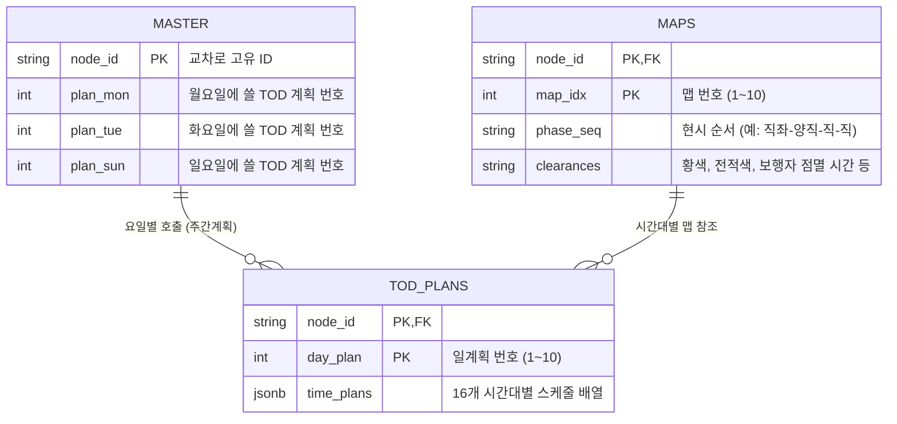

# SIGMA 데이터베이스 구조 및 관계 매뉴얼

SIGMA 시뮬레이션 엔진은 빠르고 효율적인 렌더링을 위해 데이터를 3개의 계층(파일)으로 분리하여 관리합니다. 처음 시스템을 접하는 사용자나 개발자라도 아래의 3계층 구조만 이해하면 전체 신호 연동 및 스케줄링 흐름을 쉽게 파악할 수 있습니다.

---

## 🏗️ 1. 전체 구조 개요 (The 3-Tier Architecture)

교통 신호 데이터는 크게 **①마스터(교차로 정보) - ②맵(통행권 구조) - ③TOD(시간 및 운영 스케줄)**로 나뉩니다.

---

## 🗂️ 2. 테이블별 핵심 역할과 데이터 포맷

### ① 교차로 마스터 (`junctions` 테이블 / `intersections` CSV)
* **역할**: 교차로의 이름, 위치(위경도), 그리고 **주간계획(Weekly Plan)**을 관리합니다.
* **주간계획이란?**: "이 교차로는 월요일엔 1번 스케줄을, 토요일엔 2번 스케줄을 켜라"라고 지시하는 요일별 캘린더입니다.
* **주요 항목**:
  - `ID`: 교차로 고유 번호 (예: L01-001)
  - `Lat` / `Lng`: 지도 위에 표시할 좌표
  - `Weekly_plan`: 요일별 운영계획 번호 배열 (월~일, 공휴일)

### ② 신호 맵 데이터 (`signal_maps` 테이블 / CSV)
* **역할**: 시간 개념이 전혀 없는, 순수한 **현시 순서(Phase Sequence)**와 **차량/보행자 통행권 구조**만을 정의합니다.
* **설명**: 1번 맵은 "출근시간용"이 아니라, "직좌-양직-직-직"이라는 **뼈대(템플릿)**입니다. 동일한 뼈대라면 아침이든 밤이든 이 맵 번호를 불러와 재사용합니다.
* **주요 항목**:
  - `MapIdx`: 맵 번호 (1~10번)
  - `movA`, `movB`: 각 현시(Phase)에서 차량이 이동할 수 있는 방향
  - `pedMovA`, `pedMovB`: 각 현시에서 켜지는 보행자 횡단보도
  - `yellowA`, `allredA`: 물리적 차로 길이에 따른 황색/전적색 (클리어런스) 고정 시간

### ③ TOD 운영계획 (`tod_plans` 테이블 / CSV)
* **역할**: **"시간(Schedule)"**과 **"신호 시간(Timings)"**을 한곳에 합쳐놓은 가장 중요한 테이블입니다. 하나의 Row 안에 하루 24시간 전체의 타임라인이 들어갑니다.
* **설명**: 교차로당 최대 10개의 일계획(Day Plan)을 만들 수 있으며, 각 일계획 안에는 최대 16개의 시간대(Time Slot) 블록이 들어있습니다.
* **주요 항목 (1개 시간대 블록 기준)**:
  - `시작 시간`: 예) 06:00
  - `맵 번호 (MapIdx)`: 이 시간에 가동할 신호 맵(뼈대) 번호
  - `주기 (Cycle)`: 1주기 전체 시간 (예: 140초)
  - `연동값 (Offset)`: 인접 교차로와의 녹색신호 연동(옵셋) 시간
  - `현시별 배분시간 (Splits)`: 1현시는 30초, 2현시는 40초 등 각 현시가 차지할 녹색 시간 (Split A/B)

---

## 🚀 3. 시뮬레이터(SIGMA_SIM) 작동 원리 요약

이 3계층 구조 덕분에 브라우저(프론트엔드)는 복잡한 데이터 조립 과정 없이, 아주 직관적으로 신호를 렌더링합니다.

1. **마스터 확인**: 사용자가 '화요일 오전 9시'를 조회합니다. 시뮬레이터는 마스터의 `Weekly_plan`을 보고 "아, 화요일엔 **1번 일계획**을 쓰는구나" 하고 파악합니다.
2. **TOD 확인**: 1번 일계획(TOD) 안의 16개 시간대를 뒤져 09:00에 해당하는 블록을 찾습니다. "09:00에는 **주기 140초, 연동 20초, 맵 2번**을 쓰네" 하고 판단합니다.
3. **맵 확인**: **2번 맵** 데이터를 불러와 "직좌 - 양직 - 직 - 직" 순서대로 140초를 분배하여 애니메이션을 그립니다.

이러한 독립적 분리 구조는 중복 데이터를 줄여 파일 용량을 최소화하고, 서버 동기화(Bulk Upsert) 시 무결성 오류를 원천 차단합니다.
